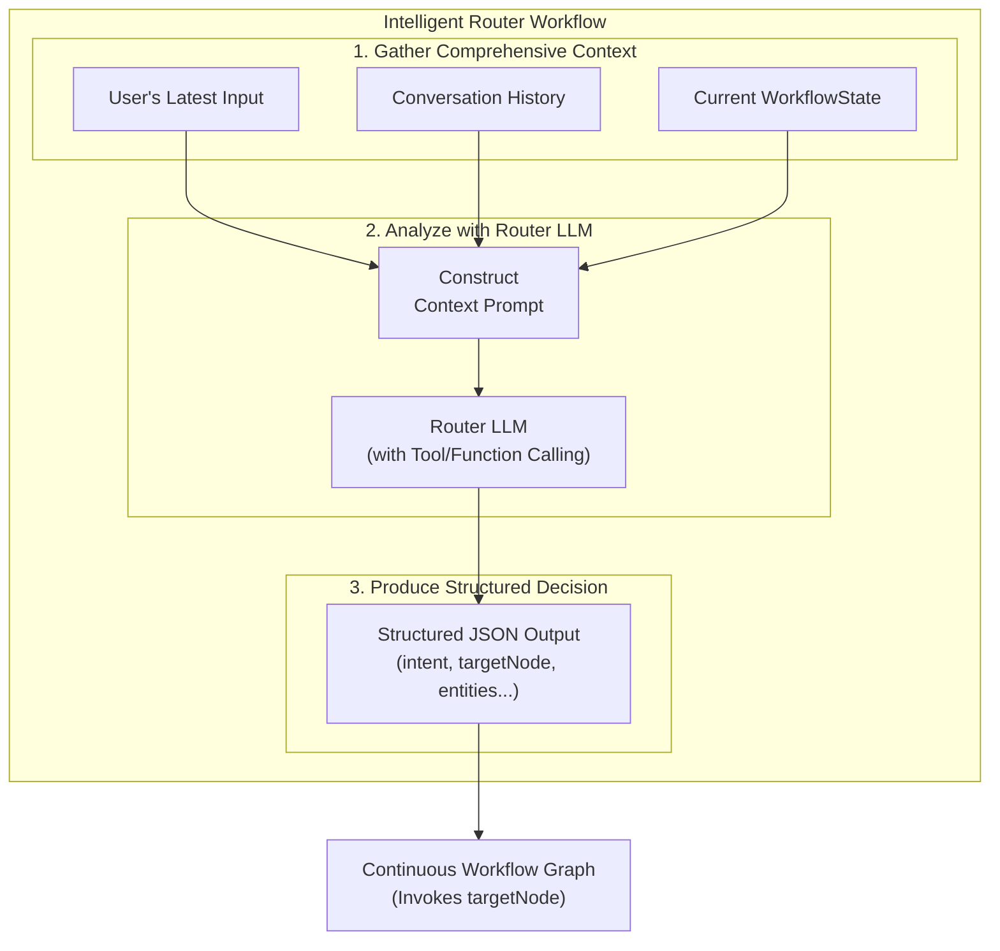
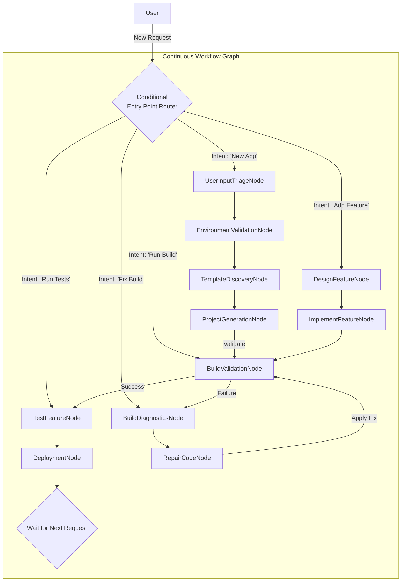

# Continuous Workflow Orchestration: A Multi-Workflow Vision

## 1. Introduction: Beyond Linear Workflows

The current Mobile Native App Generation MCP server, as detailed in [`5_mobile_native_app_generation.md`](./5_mobile_native_app_generation.md), implements a **Deterministic Workflow Orchestration** model. This model has successfully proven the core vision of prompt-to-app development by guiding a user through a linear, three-phase process: Plan, Design/Iterate, and Run. It uses a `LangGraph.js` `StateGraph` with a fixed `START` and `END`, executing a predictable sequence of nodes.

However, real-world software development is not a linear process. It is cyclical, iterative, and often requires developers to jump into the middle of a lifecycle. The current rigid workflow presents significant limitations:

- **Inability to Start Mid-stream**: A user cannot initiate a task like "build my app" or "run tests" without starting the entire generation workflow from the beginning. Tools are dependent on a workflow state that only exists during an active, linear session.
- **Lack of True Iteration**: While the design document mentions an "Iterate" phase, the underlying graph moves linearly towards an `END`. It does not natively support looping back for refinement or handling new, unrelated user requests after a project has been generated.
- **Workflow-Only Tools**: Critical tools (e.g., for building, deploying) are tightly coupled to the workflow and cannot be used as standalone utilities, creating friction for developers who want to perform a quick, isolated action.

This document proposes a evlolution of this: **Continuous Workflow Orchestration**. This model reframes the development lifecycle not as a finite process with a beginning and an end, but as a continuous, stateful loop that a user can enter and exit at any point.

## 2. The Continuous Workflow Pattern

The core of this new vision is the **Continuous Workflow Pattern**. Inspired by the principles of continuous integration and development, this pattern models the SDLC as a graph that never truly terminates. Every user interaction is a new entry point into the graph, which intelligently routes the request to the appropriate phase of the lifecycle.

### Key Architectural Components

#### 2.1. The Intelligent Router

The core of the continuous workflow is the **Intelligent Router**. This evolves the existing `sfmobile-native-project-manager` tool. Instead of managing a linear workflow, its entire purpose is to act as the "brain" of the operation, deciding which part of the development lifecycle to engage based on the user's intent and the project's current state.

It works by delegating the complex routing decision to a specialized LLM call. By analyzing a rich set of inputs to produce a structured, actionable decision, it can intelligently invoke the correct starting node on the underlying `StateGraph`.

##### Router Workflow



##### 1. The Comprehensive Context Prompt

To make a smart decision, the router LLM is fed a detailed prompt with a complete picture of the situation:

-   **System Preamble**: A clear instruction defining its role as an expert project manager who must decide the next logical step.
-   **The `WorkflowState`**: The agent's internal memory, including `lastAction`, `buildStatus`, and `currentTask`.
-   **Conversation History**: The last 3-5 user/agent turns to provide immediate conversational context.
-   **The User's Latest Input**: The actual query to be processed.

##### 2. Structured, Actionable Output

Crucially, the router LLM is forced to respond with a structured JSON object using the model's tool-calling capabilities. This ensures the output is predictable and machine-readable. The schema would look like this:

```json
{
  "intent": "string", // An enum: "ADD_FEATURE", "FIX_BUILD", "RUN_TESTS", etc.
  "targetNode": "string", // The exact graph node to route to: "DesignFeatureNode", etc.
  "entities": {
    "featureDescription": "string | null",
    "fileName": "string | null"
  },
  "confidence": "float", // A score from 0.0 to 1.0 on how certain the LLM is.
  "reasoning": "string", // A brief explanation for its choice.
  "clarificationQuestion": "string | null" // If confidence is low, what to ask the user.
}
```

This approach transforms the router from a weak link into an intelligent, context-aware decision engine, making the entire workflow more resilient and powerful.

#### 2.2. A Graph Without an `END`

In the continuous model, the `END` node is removed. Instead of terminating, nodes complete their tasks, update the state, and the workflow effectively returns to a waiting state. The next user interaction will re-invoke the orchestrator, which starts again at the `sdlcRouter`, thus beginning the cycle anew.

**Conceptual Graph Assembly**:

```javascript
import { StateGraph } from '@langchain/langgraph';

const workflow = new StateGraph(SdlcState)
  .addNode('gatherRequirements', gatherRequirementsNode)
  .addNode('implementFeature', implementFeatureNode)
  .addNode('runTests', runTestsNode)
  .addNode('buildValidationNode', buildValidationNode)
  // The router is the only way in
  .setEntryPoint(sdlcRouter)
  // The router's decision directly maps to a node name
  .addConditionalEdges(sdlcRouter, (destination) => destination);

// Edges now define transitions between logical development phases, not a linear path
workflow.addEdge('implementFeature', 'runTests');
workflow.addEdge('runTests', 'gatherRequirements'); // Loop back to wait for next instruction

const app = workflow.compile({ checkpointer: myPersistentCheckpointer });
```

#### 2.3. Evolving the `WorkflowState`

The `WorkflowState` becomes even more critical, acting as the living, long-term representation of the software project. To support the continuous workflow, it must be enhanced to track the project's entire lifecycle. The proposed `MobileNativeWorkflowState` schema in `metadata.ts` would be updated to merge existing properties with new ones for long-term state tracking.

**Proposed `MobileNativeWorkflowState` Schema**:

```typescript
import { Annotation } from '@langchain/langgraph';

export const MobileNativeWorkflowState = Annotation.Root({
  // --- Core Properties ---
  userInput: Annotation<unknown>,
  platform: Annotation<'iOS' | 'Android'>,
  
  // --- Project Generation & Identity ---
  projectName: Annotation<string>,
  projectPath: Annotation<string>,
  packageName: Annotation<string>,
  organization: Annotation<string>,
  selectedTemplate: Annotation<string>,
  environmentValidated: Annotation<boolean>,

  // --- OAuth Configuration ---
  connectedAppClientId: Annotation<string>,
  connectedAppCallbackUri: Annotation<string>,
  loginHost: Annotation<string>,

  // --- Continuous Lifecycle State ---
  lastAction: Annotation<'design' | 'implement' | 'test' | 'build' | 'repair' | 'deploy' | null>,
  currentTask: Annotation<string | null>, // High-level goal, e.g., "Implement search bar"
  // --- Build, Test, & Deploy State ---
  buildType: Annotation<'debug' | 'release'>,
  targetDevice: Annotation<string>,
  buildStatus: Annotation<'success' | 'failed' | 'in_progress' | 'unknown'>,
  testResults: Annotation<string | null>,
  deploymentStatus: Annotation<string | null>,
});
```

### 2.4. Example Workflow in Action

To illustrate how the continuous workflow operates, let's walk through a multi-turn user journey.

#### Workflow Diagram

This diagram shows the central role of the router. The user always interacts with the router, which then directs the workflow to the appropriate node or sub-graph based on the user's intent and the project's state.



#### Step-by-Step User Journey

1.  **Turn 1: Project Creation**
    *   **User**: "I want to build a new iOS app to track my contacts."
    *   **Router Input**: `userInput`="I want to build...", `projectPath`=null.
    *   **Router Decision**: Intent is `new_app`. Routes to `UserInputTriageNode`.
    *   **Action**: The agent executes the linear generation phase (Triage → Env → Template → Generate), creates the project, and validates it with an initial build.
    *   **Final State**: `projectPath`="/path/to/ContactApp", `lastAction`="build", `buildStatus`="success".

2.  **Turn 2: Designing a Feature**
    *   **User**: "Now, add a search bar to the contact list."
    *   **Router Input**: `userInput`="add a search bar...", `projectPath`="/path/to/ContactApp".
    *   **Router Decision**: Intent is `add_feature`. Routes to `DesignFeatureNode`.
    *   **Action**: The agent analyzes the request and the existing codebase. It proposes a plan: "I will modify `ContactListView.swift` to add a `UISearchBar` and update the view model to handle filtering."
    *   **Final State**: `lastAction`="design".

3.  **Turn 3: Implementing the Feature**
    *   **User**: "That plan looks good. Go ahead."
    *   **Router Input**: `userInput`="That plan looks good...", `lastAction`="design".
    *   **Router Decision**: Intent is `implement_feature`. Routes to `ImplementFeatureNode`.
    *   **Action**: The agent modifies the codebase according to the approved plan.
    *   **Final State**: `lastAction`="implement".

4.  **Turn 4: Running a Build**
    *   **User**: "Okay, let's see if that works. Build the app."
    *   **Router Input**: `userInput`="Build the app.", `projectPath`="/path/to/ContactApp".
    *   **Router Decision**: Intent is `run_build`. Routes directly to `BuildValidationNode`.
    *   **Action**: The agent invokes the native build tools. The build fails due to a missing import.
    *   **Final State**: `lastAction`="build", `buildStatus`="failed".

5.  **Turn 5: Fixing the Build**
    *   **User**: "Looks like it failed. Can you fix it?"
    *   **Router Input**: `userInput`="Can you fix it?", `buildStatus`="failed".
    *   **Router Decision**: Intent is `fix_build`. Routes to `BuildDiagnosticsNode`.
    *   **Action**: The agent analyzes the build logs, identifies the missing import, and uses the `RepairCodeNode` to add it. It then automatically re-routes to the `BuildValidationNode` to try again. This time, the build succeeds.
    *   **Final State**: `lastAction`="build", `buildStatus`="success".

This journey demonstrates the power and flexibility of the continuous model. The user can seamlessly transition between project generation, feature implementation, and build-fix cycles, with the agent intelligently entering the workflow at the correct point each time.

### 2.5. Designing Re-entrant and Flexible Tools

A core principle of the continuous workflow is that it does not have a single, fixed starting point. While not every tool can be the *first* step in every scenario (for example, you cannot run a build on a project that doesn't exist), the Intelligent Router has the flexibility to select **any logical node** as an entry point based on the project's current state.

In the old linear model, a tool like `BuildValidationNode` could *only* run after `ProjectGenerationNode`. Now, if a project already exists, the router can jump directly to `BuildValidationNode`. This is what makes the system feel responsive and intelligent. To enable this, every tool (node) must be designed to be **re-entrant and flexible**.


This is achieved by designing tools with a dual-mode approach to gathering context:

1.  **Orchestrated Invocation**: When a tool is called by the Intelligent Router as part of an ongoing session, it receives the rich, in-memory `workflowState` and uses that context.

2.  **On-Demand Invocation**: If a tool is the first node invoked in a session, it receives minimal state and must be capable of deriving its own context from the file system. For example, the `BuildValidationNode`, when invoked on-demand, would look for a project configuration file (e.g., `sfdx-project.json`) in the current directory to determine the project path and platform.

This dual-mode capability ensures that every node is a valid entry point, empowering the Intelligent Router to direct the workflow with maximum flexibility.


## 4. Benefits of the Continuous Workflow Model

1.  **Flexibility and Realism**: Aligns the agent's capabilities with the true, cyclical nature of software development.
2.  **Seamless Iteration**: Users can build, test, refine, and add features in a continuous loop without artificial stops and starts.
3.  **Standalone Tooling**: Empowers developers by allowing them to use powerful tools like `build` and `deploy` for quick, one-off tasks on existing projects.
4.  **Stateful Project Context**: The agent maintains a long-term understanding of the project's state, history, and artifacts, just like a human developer.
5.  **Future-Proof Architecture**: This model is extensible to all phases of the SDLC, from initial ideation to long-term maintenance and refactoring.

## 5. Out of Scope

**Implement State Reconciliation**: Mechanism for the router to detect and handle external changes to the project state.
