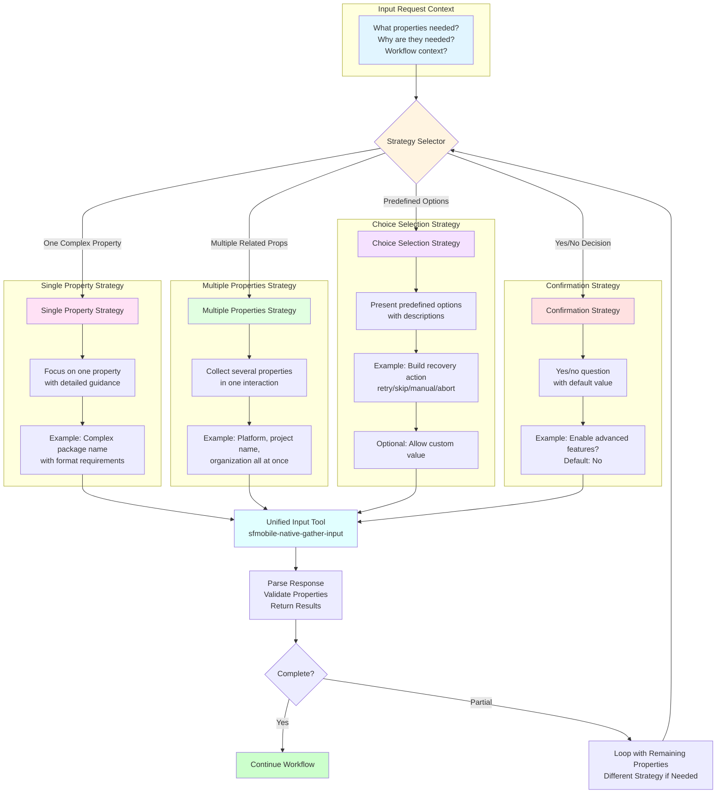
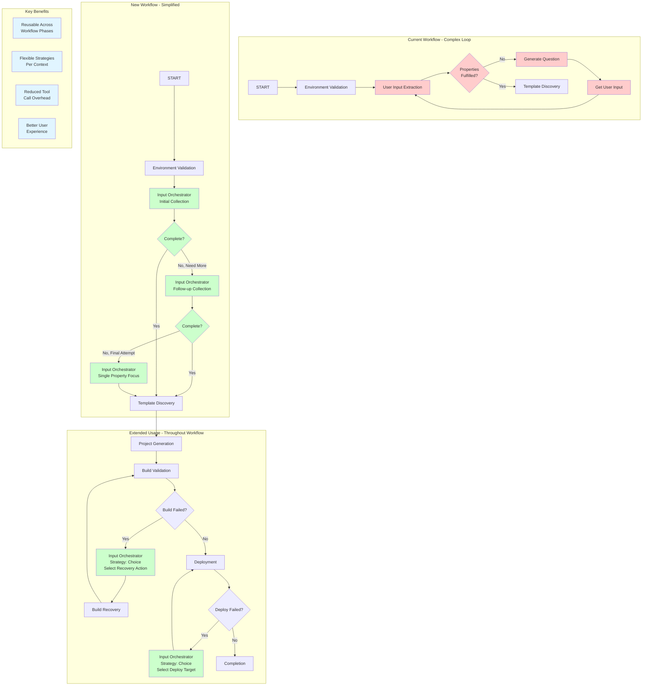

# Flexible User Input Gathering System

## Overview

This document outlines the design for a comprehensive, extensible user input gathering system for the Mobile Native MCP Server workflow. The system addresses limitations in the current single-property-at-a-time approach by introducing flexible input collection strategies that support multiple interaction patterns while minimizing tool invocation overhead.

## Current System Limitations

### Tool Call Overhead

The current implementation requires multiple tool invocations to gather a single piece of information:

1. **UserInputExtractionNode** → Extracts properties from user input (1 tool call)
2. **CheckPropertiesFulFilledRouter** → Checks if properties are complete (no tool call, conditional logic)
3. **GenerateQuestionNode** → Generates a question for missing property (1 tool call)
4. **GetUserInputNode** → Solicits user response (1 tool call)
5. Loop back to step 1

**Result**: 3 tool calls per missing property, creating a clunky user experience.

### System Comparison Diagram

The following diagram illustrates the dramatic difference between the current and proposed systems:

```mermaid
graph TB
    subgraph "Current System - Single Property at a Time"
        A1[User Initial Input] --> B1[UserInputExtractionNode<br/>Tool Call #1]
        B1 --> C1{Check Properties<br/>Fulfilled?}
        C1 -->|Missing Props| D1[GenerateQuestionNode<br/>Tool Call #2]
        D1 --> E1[GetUserInputNode<br/>Tool Call #3]
        E1 --> F1[User Response]
        F1 --> B2[UserInputExtractionNode<br/>Tool Call #4]
        B2 --> C2{Check Properties<br/>Fulfilled?}
        C2 -->|Still Missing| D2[GenerateQuestionNode<br/>Tool Call #5]
        D2 --> E2[GetUserInputNode<br/>Tool Call #6]
        E2 --> F2[User Response]
        F2 --> B3[UserInputExtractionNode<br/>Tool Call #7]
        B3 --> C3{Check Properties<br/>Fulfilled?}
        C3 -->|Still Missing| D3[... continues ...]
        D3 --> E3[3 tool calls per property]
        C3 -->|All Props| G1[Continue Workflow]
        
        style B1 fill:#ffcccc
        style D1 fill:#ffcccc
        style E1 fill:#ffcccc
        style B2 fill:#ffcccc
        style D2 fill:#ffcccc
        style E2 fill:#ffcccc
        style B3 fill:#ffcccc
        style E3 fill:#ffcccc
    end
    
    subgraph "New System - Flexible Strategies"
        A2[User Initial Input] --> B4[InputOrchestratorNode<br/>Strategy: Multiple Properties<br/>Tool Call #1]
        B4 --> C4{Check Response}
        C4 -->|Complete| G2[Continue Workflow]
        C4 -->|Partial| D4[InputOrchestratorNode<br/>Strategy: Multiple Properties<br/>Tool Call #2]
        D4 --> C5{Check Response}
        C5 -->|Complete| G2
        C5 -->|Still Missing| E4[InputOrchestratorNode<br/>Strategy: Single/Choice<br/>Tool Call #3]
        E4 --> G2
        
        style B4 fill:#ccffcc
        style D4 fill:#ccffcc
        style E4 fill:#ccffcc
    end
    
    subgraph "Efficiency Comparison"
        H1[Current System:<br/>15 tool calls<br/>for 5 properties] 
        H2[New System:<br/>2-3 tool calls<br/>for 5 properties]
        H3[85% Reduction<br/>in Tool Calls]
        
        H1 -.->|vs| H2
        H2 -.->|result| H3
        
        style H1 fill:#ffcccc
        style H2 fill:#ccffcc
        style H3 fill:#ccffff
    end
```



### Limited Interaction Patterns

The current system only supports:
- Single property collection at a time
- Free-form text responses
- Sequential, one-at-a-time prompting

This approach lacks flexibility for:
- Bulk property collection ("Please provide X, Y, and Z")
- Guided choice selection ("Would you like option A, B, or C?")
- Context-aware defaults ("I suggest X, or you can provide your own")
- Conditional property collection (only ask Y if X was selected)

### Limited Reusability

The input gathering logic is tightly coupled to initial workflow setup and cannot be easily reused in other workflow phases such as:
- Build recovery decisions
- Deployment target selection
- Feature configuration choices
- Error resolution options

---

## Design Principles

### 1. Minimize Tool Invocations

Consolidate input gathering into fewer, smarter tool calls that handle multiple concerns simultaneously.

### 2. Support Multiple Interaction Patterns

Enable different collection strategies based on context:
- **Single Property**: For complex properties requiring focused attention
- **Multiple Properties**: For related properties that can be gathered together
- **Choice Selection**: For predefined options with optional custom input
- **Confirmations**: For yes/no decisions with defaults

### 3. Maintain Extensibility

Design a generic system that can be reused throughout the workflow, not just for initial setup.

### 4. Preserve LLM Agency

Follow the agentic philosophy: provide context and guidance, let the LLM make intelligent decisions about execution.

### 5. Graceful Degradation

Support partial success—if some properties are provided but others aren't, continue with what's available.

---

## Architecture Overview

### Strategy Selection and Execution Flow

The following diagram shows how the system selects and executes different input gathering strategies:



### Core Components

```
┌─────────────────────────────────────────────────────────────┐
│                    Input Request Context                     │
│  (What properties are needed, why, and how to gather them)   │
└──────────────────────────┬──────────────────────────────────┘
                           │
                           ▼
┌─────────────────────────────────────────────────────────────┐
│                  Input Strategy Selector                     │
│      (Determines optimal gathering approach for context)     │
└──────────────────────────┬──────────────────────────────────┘
                           │
         ┌─────────────────┼─────────────────┐
         │                 │                 │
         ▼                 ▼                 ▼
┌─────────────┐   ┌─────────────┐   ┌─────────────┐
│   Single    │   │  Multiple   │   │   Choice    │
│  Property   │   │ Properties  │   │  Selection  │
│  Strategy   │   │  Strategy   │   │  Strategy   │
└──────┬──────┘   └──────┬──────┘   └──────┬──────┘
       │                 │                 │
       └─────────────────┼─────────────────┘
                         ▼
┌─────────────────────────────────────────────────────────────┐
│                  Unified Input Executor                      │
│       (Handles user interaction and response parsing)        │
└──────────────────────────┬──────────────────────────────────┘
                           │
                           ▼
┌─────────────────────────────────────────────────────────────┐
│                  Validation & Integration                    │
│    (Validates responses, updates state, determines next)     │
└─────────────────────────────────────────────────────────────┘
```

### Key Abstractions

#### 1. Input Request Context

Describes what information is needed and how to gather it.

```typescript
interface InputRequestContext {
  // What properties need to be collected
  properties: PropertyMetadataCollection;
  
  // Why these properties are needed (for context in prompts)
  purpose: string;
  
  // Suggested gathering strategy
  strategy?: InputGatheringStrategy;
  
  // Context from current workflow state
  workflowContext?: Record<string, unknown>;
  
  // Whether to allow partial responses
  allowPartial?: boolean;
  
  // Maximum interaction rounds before giving up
  maxRounds?: number;
}
```

#### 2. Input Gathering Strategy

Defines how to collect the required properties.

```typescript
type InputGatheringStrategy = 
  | SinglePropertyStrategy
  | MultiplePropertiesStrategy
  | ChoiceSelectionStrategy
  | ConfirmationStrategy;

interface SinglePropertyStrategy {
  type: 'single';
  // Collect one property at a time, useful for complex inputs
  propertyName: string;
}

interface MultiplePropertiesStrategy {
  type: 'multiple';
  // Collect several related properties in one interaction
  propertyNames: string[];
  // Group label for the properties
  groupLabel?: string;
}

interface ChoiceSelectionStrategy {
  type: 'choice';
  // Property to collect
  propertyName: string;
  // Predefined options to choose from
  choices: Array<{
    label: string;
    value: unknown;
    description?: string;
  }>;
  // Whether user can provide custom value
  allowCustom: boolean;
  // Default choice if any
  defaultChoice?: string;
}

interface ConfirmationStrategy {
  type: 'confirmation';
  // Property to collect (typically boolean)
  propertyName: string;
  // The question to ask
  question: string;
  // Default value if user just confirms
  defaultValue?: boolean;
}
```

#### 3. Input Response

Structured result from user interaction.

```typescript
interface InputResponse {
  // Properties successfully collected
  collectedProperties: Record<string, unknown>;
  
  // Properties that are still missing
  missingProperties: string[];
  
  // Whether user explicitly cancelled/skipped
  userCancelled: boolean;
  
  // Number of interaction rounds used
  roundsUsed: number;
  
  // Whether all required properties were collected
  complete: boolean;
}
```

---

## Detailed Component Design

### 1. Input Orchestrator Node

A generic workflow node that replaces the current multi-node loop.

```typescript
export class InputOrchestratorNode extends BaseNode {
  /**
   * Orchestrates user input gathering using flexible strategies.
   * 
   * This node:
   * 1. Analyzes the input request context
   * 2. Determines optimal gathering strategy (or uses provided one)
   * 3. Executes the collection process
   * 4. Validates and integrates responses
   * 5. Returns complete or partial results
   */
  execute = (state: State): Partial<State> => {
    const requestContext = this.buildRequestContext(state);
    
    // Determine or use provided strategy
    const strategy = requestContext.strategy 
      ?? this.selectOptimalStrategy(requestContext);
    
    // Execute the input gathering
    const response = this.executeInputGathering(
      requestContext, 
      strategy
    );
    
    // Integrate results into state
    return this.integrateResponse(response, state);
  };
  
  private selectOptimalStrategy(
    context: InputRequestContext
  ): InputGatheringStrategy {
    const propertyCount = Object.keys(context.properties).length;
    
    // Single property - focus mode
    if (propertyCount === 1) {
      return { 
        type: 'single', 
        propertyName: Object.keys(context.properties)[0] 
      };
    }
    
    // Multiple related properties - batch collection
    if (this.arePropertiesRelated(context.properties)) {
      return {
        type: 'multiple',
        propertyNames: Object.keys(context.properties),
        groupLabel: context.purpose
      };
    }
    
    // Check if any properties have predefined choices
    const choiceProperty = this.findChoiceProperty(context.properties);
    if (choiceProperty) {
      return choiceProperty;
    }
    
    // Default: collect multiple properties together
    return {
      type: 'multiple',
      propertyNames: Object.keys(context.properties)
    };
  }
  
  private executeInputGathering(
    context: InputRequestContext,
    strategy: InputGatheringStrategy
  ): InputResponse {
    switch (strategy.type) {
      case 'single':
        return this.executeSinglePropertyCollection(context, strategy);
      case 'multiple':
        return this.executeMultiplePropertiesCollection(context, strategy);
      case 'choice':
        return this.executeChoiceSelection(context, strategy);
      case 'confirmation':
        return this.executeConfirmation(context, strategy);
    }
  }
}
```

### 2. Unified Input Tool

A single MCP tool that handles all input gathering patterns, reducing tool call overhead.

```typescript
/**
 * MCP Tool: sfmobile-native-gather-input
 * 
 * A unified tool for gathering user input across multiple interaction patterns.
 * Supports single properties, multiple properties, choice selection, and confirmations.
 */
export const GATHER_INPUT_TOOL = {
  toolId: 'sfmobile-native-gather-input',
  description: `Gather user input for mobile native workflow using flexible interaction patterns.
  
  This tool supports multiple gathering strategies:
  - Single property: Focus on one complex property
  - Multiple properties: Collect several related properties at once  
  - Choice selection: Present predefined options with optional custom input
  - Confirmation: Yes/no questions with defaults
  
  The tool intelligently formats prompts based on strategy and handles response parsing.`,
  
  inputSchema: z.object({
    strategy: z.discriminatedUnion('type', [
      z.object({
        type: z.literal('single'),
        property: z.object({
          name: z.string(),
          description: z.string(),
          friendlyName: z.string(),
          examples: z.array(z.string()).optional()
        })
      }),
      z.object({
        type: z.literal('multiple'),
        properties: z.array(z.object({
          name: z.string(),
          description: z.string(),
          friendlyName: z.string(),
          examples: z.array(z.string()).optional()
        })),
        groupLabel: z.string().optional()
      }),
      z.object({
        type: z.literal('choice'),
        property: z.object({
          name: z.string(),
          description: z.string(),
          friendlyName: z.string()
        }),
        choices: z.array(z.object({
          label: z.string(),
          value: z.unknown(),
          description: z.string().optional()
        })),
        allowCustom: z.boolean(),
        defaultChoice: z.string().optional()
      }),
      z.object({
        type: z.literal('confirmation'),
        property: z.object({
          name: z.string(),
          friendlyName: z.string()
        }),
        question: z.string(),
        defaultValue: z.boolean().optional()
      })
    ]),
    purpose: z.string().describe('Why this information is needed'),
    workflowContext: z.record(z.unknown()).optional()
  }),
  
  resultSchema: z.object({
    collectedProperties: z.record(z.unknown()),
    userProvidedText: z.string(),
    strategyUsed: z.string()
  })
};
```

### Tool Implementation

The tool provides **guidance to the host LLM** which then formulates natural questions and handles user interaction. This maintains the conversational quality of the current system while reducing tool calls.

#### Two-Phase Approach

**Phase 1: Tool Returns Guidance to LLM**

The tool provides instructions to the host LLM about how to interact with the user:

```typescript
export async function executeGatherInput(
  input: z.infer<typeof GATHER_INPUT_TOOL.inputSchema>
): Promise<z.infer<typeof GATHER_INPUT_TOOL.resultSchema>> {
  
  // Generate guidance for the host LLM based on strategy
  const guidance = generateGuidanceForStrategy(input);
  
  return {
    guidance,
    strategyType: input.strategy.type,
    propertyMetadata: input.strategy // Include for context
  };
}

function generateGuidanceForStrategy(
  input: z.infer<typeof GATHER_INPUT_TOOL.inputSchema>
): string {
  const { strategy, purpose, workflowContext } = input;
  
  let guidance = `# ROLE
You are a friendly and helpful conversational assistant helping a user configure their mobile application.

# TASK
`;

  switch (strategy.type) {
    case 'single': {
      const { property } = strategy;
      guidance += `Ask the user for a single piece of information in a clear, polite way.

# CONTEXT
You need to ask the user for the value of the following property:
- Property Name: ${property.name}
- Friendly Name: ${property.friendlyName}
- Description: ${property.description}
- Purpose: ${purpose}
${property.examples?.length ? `- Examples: ${property.examples.join(', ')}` : ''}

# INSTRUCTIONS
1. Use the "Friendly Name" in your question
2. Your question should be polite and conversational
3. If examples are provided, include one as a helpful hint
4. Wait for the user's response before proceeding
`;
      break;
    }
    
    case 'multiple': {
      const { properties, groupLabel } = strategy;
      guidance += `Ask the user for multiple related pieces of information in a single, well-organized prompt.

# CONTEXT
Purpose: ${purpose}
${groupLabel ? `Group: ${groupLabel}` : ''}

You need to collect the following properties:
${properties.map((prop, idx) => `
${idx + 1}. ${prop.friendlyName}
   - Description: ${prop.description}
   ${prop.examples?.length ? `- Examples: ${prop.examples.join(', ')}` : ''}
`).join('')}

# INSTRUCTIONS
1. Present all properties in a clear, numbered or bulleted list
2. Make it clear the user can provide the information in any natural format
3. Explain you'll extract the relevant information from their response
4. Be encouraging - they don't need to match a specific format
5. Wait for their response with all (or as many as possible) of the values
`;
      break;
    }
    
    case 'choice': {
      const { property, choices, allowCustom, defaultChoice } = strategy;
      guidance += `Present a set of predefined choices to the user and let them select one.

# CONTEXT
You need to ask the user to select a value for: ${property.friendlyName}
- Description: ${property.description}
- Purpose: ${purpose}

Available choices:
${choices.map((choice, idx) => `
${idx + 1}. ${choice.label}${choice.label === defaultChoice ? ' (recommended)' : ''}
   ${choice.description ? `- ${choice.description}` : ''}
   - Value: ${JSON.stringify(choice.value)}
`).join('')}

${allowCustom ? '- User can also provide their own custom value' : ''}
${defaultChoice ? `- Default/recommended choice: ${defaultChoice}` : ''}

# INSTRUCTIONS
1. Present the choices clearly, numbered or as a list
2. Highlight the recommended option if there is one
${allowCustom ? '3. Mention they can provide their own value if the choices don\'t fit' : ''}
${defaultChoice ? '4. Indicate they can press Enter to accept the default' : ''}
5. Wait for their selection or custom input
`;
      break;
    }
    
    case 'confirmation': {
      const { question, defaultValue } = strategy;
      guidance += `Ask the user a yes/no question to confirm a decision.

# CONTEXT
Question context: ${purpose}
The specific question: ${question}
${defaultValue !== undefined ? `Default answer: ${defaultValue ? 'Yes' : 'No'}` : ''}

# INSTRUCTIONS
1. Ask the question clearly and conversationally
2. Make it clear this is a yes/no question
${defaultValue !== undefined ? `3. Indicate the default value (they can press Enter to accept it)` : ''}
4. Accept various forms of yes/no (yes, no, y, n, true, false, etc.)
5. Wait for their confirmation
`;
      break;
    }
  }
  
  guidance += `

# WORKFLOW CONTEXT
${workflowContext ? `
Additional context that may be relevant:
${JSON.stringify(workflowContext, null, 2)}
` : 'No additional workflow context provided.'}

# OUTPUT FORMAT
After receiving the user's response:
- Extract the relevant property values from their natural language response
- Return them in the expected schema format
- Validate against any provided constraints
- If information is missing or unclear, ask follow-up questions naturally
`;

  return guidance;
}
```

**Phase 2: LLM Interacts with User**

The host LLM receives the guidance and:
1. Formulates a natural, contextual question
2. Presents it to the user
3. Receives the user's response
4. Extracts and validates the properties
5. Returns the structured result

This approach:
- ✅ **Maintains conversational quality** - LLM generates natural questions
- ✅ **Reduces tool calls** - One tool call provides guidance for entire interaction
- ✅ **Preserves flexibility** - LLM adapts based on user responses
- ✅ **Supports all strategies** - Same pattern works for single, multiple, choice, and confirmation

#### Comparison with Current System

**Current System:**
```
For each property:
1. UserInputExtractionNode → extracts from input (Tool call #1)
2. CheckPropertiesFulFilledRouter → finds missing property
3. GenerateQuestionNode → returns guidance to LLM (Tool call #2)
4. LLM formulates question → asks user
5. GetUserInputNode → gets response (Tool call #3)
6. Loop back to step 1

Total: 3 tool calls × N properties
```

**New System:**
```
For all properties (or subset):
1. InputOrchestratorNode → analyzes needed properties
2. Unified GATHER_INPUT_TOOL → returns guidance for all properties (Tool call #1)
3. LLM formulates comprehensive question(s) → asks user
4. User provides multiple values in natural format
5. LLM extracts and validates → returns structured result
6. If incomplete, repeat with remaining properties (Tool call #2)

Total: 1-3 tool calls for all properties
```

**Key Differences:**

| Aspect | Current System | New System |
|--------|---------------|------------|
| **Tool calls per property** | 3 | ~0.5 (shared across properties) |
| **Question generation** | LLM-mediated (✓) | LLM-mediated (✓) |
| **Properties per round** | 1 | Multiple |
| **LLM flexibility** | Per-property | Cross-property context |
| **User experience** | Sequential Q&A | Natural conversation |

**What's Preserved:**
- ✅ LLM generates natural, contextual questions (not programmatic templates)
- ✅ LLM adapts based on user responses and context
- ✅ Questions are polite, clear, and conversational
- ✅ Flexibility to handle various user input formats

**What's Improved:**
- ✅ Batch guidance for multiple properties (fewer tool calls)
- ✅ LLM can see relationships between properties
- ✅ User can provide information naturally, in any order
- ✅ System adapts strategy based on what's missing

#### Example: Guidance for Multiple Properties

When the orchestrator needs to collect `platform`, `projectName`, and `organization`, the tool returns guidance like this:

```markdown
# ROLE
You are a friendly and helpful conversational assistant helping a user configure their mobile application.

# TASK
Ask the user for multiple related pieces of information in a single, well-organized prompt.

# CONTEXT
Purpose: To generate your mobile app, I need some information about your project

You need to collect the following properties:

1. platform
   - Description: Target mobile platform for the mobile app (iOS or Android)
   - Examples: iOS, Android

2. project name
   - Description: Name of your mobile application
   - Examples: MyApp, ContactManager

3. organization
   - Description: Your organization or company name
   - Examples: Acme Corp, MyCompany

# INSTRUCTIONS
1. Present all properties in a clear, numbered or bulleted list
2. Make it clear the user can provide the information in any natural format
3. Explain you'll extract the relevant information from their response
4. Be encouraging - they don't need to match a specific format
5. Wait for their response with all (or as many as possible) of the values

# OUTPUT FORMAT
After receiving the user's response:
- Extract the relevant property values from their natural language response
- Return them in the expected schema format
- Validate against any provided constraints
- If information is missing or unclear, ask follow-up questions naturally
```

The host LLM receives this guidance and might formulate a question like:

> "To get started with your mobile app, I'll need a few details:
> 
> 1. **Platform**: Are you building for iOS or Android?
> 2. **Project Name**: What would you like to call your app?
> 3. **Organization**: What's your company or organization name?
> 
> Feel free to provide these in any format - for example, you could say something like 'I want to build an iOS app called ContactManager for Acme Corp.' I'll extract the information from your response!"

This is much more natural and efficient than three separate Q&A rounds!

---

## Usage Patterns

### Pattern 1: Initial Workflow Setup (Multiple Properties)

Gather all initial properties in 2-3 interactions instead of 5+ interactions:

```typescript
// In workflow initialization
const inputContext: InputRequestContext = {
  properties: WORKFLOW_USER_INPUT_PROPERTIES,
  purpose: 'To generate your mobile app, I need some information',
  strategy: {
    type: 'multiple',
    propertyNames: ['platform', 'projectName', 'packageName', 'organization', 'loginHost']
  },
  allowPartial: true,
  maxRounds: 3
};

// Execute gathering
const response = await inputOrchestrator.execute(inputContext);

// If partial results, ask for remaining properties
if (!response.complete && response.missingProperties.length > 0) {
  const followUpContext: InputRequestContext = {
    properties: pickProperties(
      WORKFLOW_USER_INPUT_PROPERTIES, 
      response.missingProperties
    ),
    purpose: 'I still need a few more details',
    strategy: {
      type: 'multiple',
      propertyNames: response.missingProperties
    }
  };
  
  const followUpResponse = await inputOrchestrator.execute(followUpContext);
}
```

**Before**: 3 tool calls × 5 properties = 15 tool calls  
**After**: 2-3 tool calls total (one initial batch, optionally one follow-up)

### Pattern 2: Build Recovery Decision (Choice Selection)

When build fails, present recovery options:

```typescript
const recoveryContext: InputRequestContext = {
  properties: {
    recoveryAction: {
      zodType: z.enum(['retry', 'skip', 'manual', 'abort']),
      description: 'How to handle the build failure',
      friendlyName: 'recovery action'
    }
  },
  purpose: 'The build failed with the following error: [error details]',
  strategy: {
    type: 'choice',
    propertyName: 'recoveryAction',
    choices: [
      {
        label: 'Retry',
        value: 'retry',
        description: 'Attempt to fix the issue and rebuild'
      },
      {
        label: 'Skip',
        value: 'skip', 
        description: 'Skip this build and continue'
      },
      {
        label: 'Manual',
        value: 'manual',
        description: 'Provide manual fix instructions'
      },
      {
        label: 'Abort',
        value: 'abort',
        description: 'Stop the workflow'
      }
    ],
    allowCustom: false,
    defaultChoice: 'Retry'
  }
};

const response = await inputOrchestrator.execute(recoveryContext);
const action = response.collectedProperties.recoveryAction;
```

**Tool calls**: 1 (presents choices and gets response in single interaction)

### Pattern 3: Deployment Target Selection (Choice with Custom)

Let user choose from detected devices or specify custom target:

```typescript
const targetContext: InputRequestContext = {
  properties: {
    targetDevice: {
      zodType: z.string(),
      description: 'Device or simulator to deploy to',
      friendlyName: 'deployment target'
    }
  },
  purpose: 'Select a target for deployment',
  strategy: {
    type: 'choice',
    propertyName: 'targetDevice',
    choices: detectedDevices.map(device => ({
      label: device.name,
      value: device.id,
      description: `${device.platform} ${device.version}`
    })),
    allowCustom: true,
    defaultChoice: detectedDevices[0]?.name
  }
};

const response = await inputOrchestrator.execute(targetContext);
```

**Tool calls**: 1 (lists devices and gets selection)

### Pattern 4: Feature Configuration (Mixed Strategies)

Complex scenarios might need multiple rounds with different strategies:

```typescript
// Round 1: Multiple properties for basic config
const basicConfig = await inputOrchestrator.execute({
  properties: {
    featureName: { /* ... */ },
    featureDescription: { /* ... */ }
  },
  strategy: { type: 'multiple', propertyNames: ['featureName', 'featureDescription'] }
});

// Round 2: Choice for implementation approach
const approach = await inputOrchestrator.execute({
  properties: {
    implementationApproach: { /* ... */ }
  },
  strategy: {
    type: 'choice',
    propertyName: 'implementationApproach',
    choices: [/* ... */]
  }
});

// Round 3: Confirmation for advanced features
const enableAdvanced = await inputOrchestrator.execute({
  properties: {
    useAdvancedFeatures: { /* ... */ }
  },
  strategy: {
    type: 'confirmation',
    propertyName: 'useAdvancedFeatures',
    question: 'Enable advanced features? (requires additional configuration)',
    defaultValue: false
  }
});
```

**Tool calls**: 3 (one per round, but each round gathers multiple pieces of information)

---

## Migration Strategy

### Phase 1: Introduce Parallel System

1. Create new `InputOrchestratorNode` alongside existing nodes
2. Implement `GATHER_INPUT_TOOL` tool
3. Add tests for new system
4. Keep existing system operational

### Phase 2: Transition Initial User Input

1. Create alternative path in graph using new orchestrator
2. Add feature flag to switch between old and new paths
3. Test extensively with real scenarios
4. Gradually roll out new system

### Phase 3: Expand to Other Workflow Areas

1. Identify other input gathering needs:
   - Build recovery decisions
   - Deployment target selection
   - Feature configuration
   - Error resolution
2. Implement specialized contexts for each
3. Replace ad-hoc prompting with orchestrated input gathering

### Phase 4: Deprecate Old System

1. Remove feature flag once new system is proven
2. Delete old nodes: `UserInputExtractionNode`, `GenerateQuestionNode`, `GetUserInputNode`
3. Remove old tools
4. Update documentation

---

## Implementation Considerations

### State Management

The orchestrator should integrate smoothly with LangGraph state:

```typescript
// Add to workflow state
export const MobileNativeWorkflowState = Annotation.Root({
  // ... existing state ...
  
  // Input gathering state
  inputGatheringContext: Annotation<InputRequestContext>,
  inputGatheringResponse: Annotation<InputResponse>,
  inputGatheringRound: Annotation<number>
});
```

### Graph Integration

The new orchestrator can replace the entire input gathering loop:

#### Workflow Comparison: Old vs New



#### Implementation Example

```typescript
export const mobileNativeWorkflow = new StateGraph(MobileNativeWorkflowState)
  // ... existing nodes ...
  .addNode(inputOrchestratorNode.name, inputOrchestratorNode.execute)
  
  // Simplified edges - no more loop
  .addEdge(START, environmentValidationNode.name)
  .addConditionalEdges(environmentValidationNode.name, checkEnvironmentValidatedRouter.execute)
  
  // Single input gathering node
  .addEdge(
    checkEnvironmentValidatedRouter.ifValid, 
    inputOrchestratorNode.name
  )
  
  // Check completion and route
  .addConditionalEdges(inputOrchestratorNode.name, (state: State) => {
    if (state.inputGatheringResponse.complete) {
      return templateDiscoveryNode.name;
    }
    // Need more input - loop back to orchestrator
    return inputOrchestratorNode.name;
  })
  
  .addEdge(templateDiscoveryNode.name, projectGenerationNode.name)
  // ... rest of workflow ...
```

### Backward Compatibility

During migration, support both systems:

```typescript
const USE_NEW_INPUT_SYSTEM = process.env.USE_NEW_INPUT_SYSTEM === 'true';

if (USE_NEW_INPUT_SYSTEM) {
  // Use InputOrchestratorNode
  graph.addNode(inputOrchestratorNode.name, inputOrchestratorNode.execute);
  // ... new edges ...
} else {
  // Use existing multi-node system
  graph.addNode(userInputExtractionNode.name, userInputExtractionNode.execute);
  graph.addNode(generateQuestionNode.name, generateQuestionNode.execute);
  graph.addNode(getUserInputNode.name, getUserInputNode.execute);
  // ... old edges ...
}
```

---

## Benefits Summary

### 1. Reduced Tool Call Overhead

**Before**: 3 tool calls per property × 5 properties = 15 tool calls  
**After**: 2-3 tool calls total for all properties

**Result**: 80-85% reduction in tool invocations for initial setup

### 2. Improved User Experience

- More natural conversations with batch property collection
- Clear choices when options are available
- Less repetitive back-and-forth
- Faster overall interaction

### 3. Increased Flexibility

- Same system works for initial setup, build recovery, deployment, and more
- Easy to add new interaction patterns
- Strategies can be mixed and matched based on context

### 4. Better LLM Agency

- LLM can choose optimal strategy based on context
- Flexible parsing allows natural language responses
- System adapts to how users naturally provide information

### 5. Extensibility

- Generic input orchestrator works throughout workflow
- Easy to add new gathering strategies
- Reusable across different workflow phases
- Foundation for future enhancements

---

## Future Enhancements

### 1. Intelligent Strategy Selection

Use LLM to analyze context and automatically select optimal strategy:

```typescript
const strategy = await llm.selectStrategy({
  properties: requestContext.properties,
  workflowPhase: state.currentPhase,
  userHistory: state.interactionHistory,
  complexity: analyzeComplexity(requestContext.properties)
});
```

### 2. Progressive Disclosure

Start with essential properties, optionally gather advanced ones:

```typescript
const essentialProps = filterEssentialProperties(allProperties);
const optionalProps = filterOptionalProperties(allProperties);

// Gather essential first
const essentialResponse = await gather(essentialProps);

// Ask if user wants to configure optional
const configureOptional = await confirmOptionalConfiguration();
if (configureOptional) {
  const optionalResponse = await gather(optionalProps);
}
```

### 3. Smart Defaults

Learn from user patterns to suggest intelligent defaults:

```typescript
const suggestedValues = await inferDefaults({
  properties: requestContext.properties,
  userHistory: state.interactionHistory,
  projectContext: state.projectContext
});

// Present with pre-filled suggestions
const response = await gather({
  ...requestContext,
  suggestions: suggestedValues
});
```

### 4. Conditional Property Collection

Only ask for certain properties based on previous answers:

```typescript
const conditionalContext: InputRequestContext = {
  properties: {
    platform: platformProperty,
    // Only if iOS is selected
    ...(state.platform === 'iOS' ? { 
      bundleId: bundleIdProperty 
    } : {}),
    // Only if Android is selected
    ...(state.platform === 'Android' ? { 
      applicationId: applicationIdProperty 
    } : {})
  },
  strategy: { type: 'multiple', propertyNames: ['platform', /* ... */] }
};
```

### 5. Rich Input Validation

Provide real-time feedback during input gathering:

```typescript
interface ValidationResult {
  valid: boolean;
  errors?: string[];
  warnings?: string[];
  suggestions?: string[];
}

// Validate as properties are collected
const response = await gather({
  ...requestContext,
  validators: {
    packageName: validatePackageName,
    projectName: validateProjectName
  },
  onValidationError: (property, errors) => {
    // Show helpful error message and retry
  }
});
```

---

## Conclusion

The flexible user input gathering system transforms the current rigid, tool-call-heavy approach into an efficient, adaptable system that:

1. **Dramatically reduces tool call overhead** (80-85% reduction)
2. **Improves user experience** through natural, batch interactions
3. **Enables multiple interaction patterns** (single, multiple, choice, confirmation)
4. **Provides reusability** across the entire workflow
5. **Maintains LLM agency** while providing intelligent guidance

This design aligns with the project's agentic philosophy: guide the LLM with context and flexible tools, let it make intelligent decisions about execution, and minimize artificial constraints that force suboptimal user experiences.

By building this extensible foundation now, we enable future enhancements like intelligent strategy selection, progressive disclosure, smart defaults, and conditional property collection—all while maintaining backward compatibility during migration.

