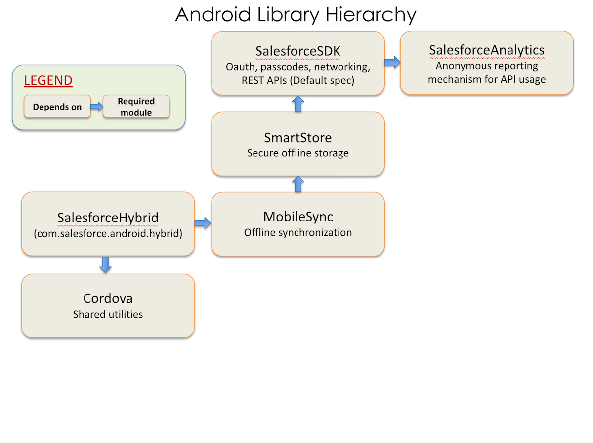

# Android Project Files

When you browse a native app in the Project window of Android Studio, you can find these library projects:

- `libs/SalesforceAnalytics`—Analytics project. Reports non-sensitive data on Mobile SDK app usage to Salesforce.
- `libs/SalesforceSDK`—Salesforce Mobile SDK project. Provides support for OAuth2 and REST API calls
- `libs/SmartStore`—SmartStore project. Provides an offline storage solution
- `libs/MobileSync`—Mobile Sync project. Implements offline data synchronization tools

Mobile SDK libraries reference each other in a dependency hierarchy, as shown in the following diagram.

