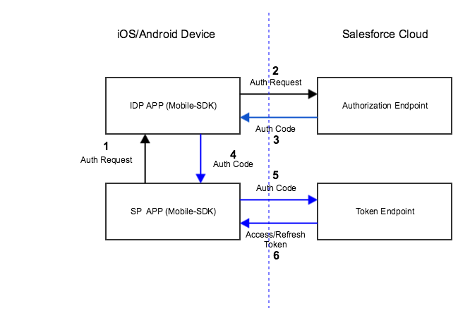

# Identity Providers: Architecture, Flow, and Connected App Requirements

All Mobile SDK identity provider setups follow the same flows and architectural outlines, regardless of platform. Salesforce connected apps for identity provider components also impose a few special requirements.

## High-Level Flow

A user can start the identity provider flow from either an identity provider app or one of its clients. When a user starts the flow by launching an identity provider client app, the first step is to choose a login preference: through either the standard Salesforce login view or an identity provider. The user can also choose identity provider login by directly launching an identity provider app. In this case, the identity provider launches the requested client app to start authentication.

Here’s a high-level diagram of what happens when the flow begins in an identity provider client. The client app doesn’t collect credentials from the user. Instead, it delegates login interaction to the identity provider app.

1.  At the user’s request, the identity provider client app requests authorization from an identity provider. The identity provider responds by sending an authorization request to a Salesforce authorization endpoint.
2.  Salesforce sends an authorization code back to the identity provider.
3.  Identity provider forwards the authorization code to the identity provider client.
4.  Identity provider client forwards the authorization code to the Salesforce OAuth token endpoint.
5.  Salesforce exchanges the authorization code for access and refresh tokens and returns the tokens to the identity provider client app. Only the client app handles the user’s OAuth tokens.

All the user has to do is click the identity provider button, then select an account. After accepting the standard request for access to Salesforce data, the user can begin working in the client app.

## A Bit More Detail

Here’s more granular information for the authentication flow. In the identity provider client:

1.  If the user has a valid refresh token in the identity provider client app, they’re automatically in––just the usual refresh token exchange occurs.
2.  If the user doesn’t have a valid refresh token, the identity provider client prompts the user to choose either standard Salesforce login or identity provider login.

Mobile SDK ignores a user’s selection of identity provider login and instead displays the standard Salesforce login screen if:

- No identity provider app is configured in the identity provider client app.
- The configured identity provider app is not found.

If authorization succeeds, the client asks Salesforce to refresh the user’s tokens. When Salesforce returns the refresh token, the flow defaults to the standard Mobile SDK post-login flow. Mobile SDK caches the refresh token returned from Salesforce.

## Connected App Requirements

- Create two connected apps––one for the identity provider app, one for identity provider client apps.
- Uncheck “Require Consumer Secret” on the connected app for identity provider client apps.
- Set the OAuth Callback URI to a custom scheme that you devise. The custom URI scheme for an identity provider client app can’t match the scheme for its identity provider app.

:::important

- An identity provider app must enable the web scope on the connected app and request it in the mobile app. Otherwise, Mobile SDK redirects the user to a login page with an error message. At this point, the flow can’t continue.
- An identity provider and its clients must use different connected apps with their own consumerKey and callbackUrl values. Otherwise, the Salesforce service returns an “invalid credentials” error message when the identity provider requests an authorization code. Currently, all Mobile SDK sample apps use the same consumerKey and callbackUrl. If you plan to adopt these apps as identity provider-client pairs, make sure that each app uses its own unique values.

:::
