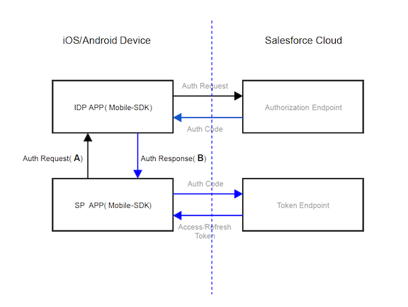

# Implementing Mobile Identity Provider Apps Without Mobile SDK

If you own a website that hosts apps that connect to Salesforce, you can configure Salesforce to provide identity services for those apps. Users of the hosted apps can then enjoy single sign-on ease through their host website. But can you adopt the same service in native mobile apps, and if so, what does it take? The answers are yes, and it's not difficult. You can define native mobile apps as Salesforce identity providers either of two ways: with Salesforce Mobile SDK, or without Salesforce Mobile SDK. This article gives you instructions for creating mobile identity providers and their clients without Salesforce Mobile SDK.

With identity provider (IdP) authentication flow, you can designate one trusted app as the central handler for all of a device's Salesforce login requirements. You can configure any app to be either an IdP app or an IdP client app, also know as a _service provider_ (SP). Client apps delegate user authentication to your designated identity provider. The identity provider uses the customer’s authenticated state to log in.

With the proper configuration, you can also implement the IdP service to non-Mobile SDK apps. Here are the requirements on the Salesforce side.

:::important

- These instructions are intended for mobile app developers who provide a suite of apps that authenticate against Salesforce but don't use Mobile SDK. For this use case, the identity provider implementation can improve the customer's experience by simulating single sign-on (SSO). However, we can provide only the description of the minimum information exchange required to centralize login authorization. **If you take this route, the mobile implementation burden lies completely with you.**
- To achieve the same result with little effort, you can use Salesforce Mobile SDK. See [**Using Mobile SDK Apps as Identity Providers**](https://developer.salesforce.com/docs/atlas.en-us.mobile_sdk.meta/mobile_sdk/auth_identity_providers.htm) in the _Salesforce Mobile SDK Development Guide_.

:::

## Rules for Identity Provider Configuration

- The identity of the IdP app is built into its client SP apps.
- The IdP app doesn’t have prior knowledge of client SP apps.
- IdP apps and SP apps exchange request and response information in pre-determined formats that both apps understand. The exchange mode for this information depends on the mobile operating system.
- The IdP app maintains a list of users that are currently logged in.
- For a known user, the IdP app requests an authorization code from Salesforce. For an unrecognized user, the IdP app presents a Salesforce login screen.
- When the SP app receives an authorization code from the IdP app, the SP app directly uses the code to update the user’s authentication artifacts. No tokens or passwords are shared between an SP app and its IdP.
- An IdP and its SP client apps can be published under different developer accounts.

## Authentication Flow

The flow of identity provider authentication is the same regardless of whether you use Mobile SDK. Let's revisit the basic flow diagram.



For SP-initiated flows, your IdP app handles the authorization request received from any SP app (A). After negotiating with the Salesforce service, the IdP app sends the auth code received from Salesforce to the SP app (B). Your IdP app shares its custom URL scheme or package ID with its client apps.

The following sections describe the messages sent for (A) and (B).

## (A) Handle an Authorization Request from an SP App

SP apps send authorization requests with the following information. IdP apps expect this information and provide code to digest it.

- oauth_client_id

  - : Client ID of SP application.

- code_challenge

  - : A cryptographic hash using the private keys of the SP app. See [Proof Key for Code Exchange by OAuth Public Clients](https://tools.ietf.org/html/rfc7636).

- oauth_redirect_uri

  - : Redirect URI for SP app. Must be registered in the SP's connected app.

- scopes

  - : Comma-separated list of requested scopes.

- user_hint

  - : For use with IDP initiated flow. Used as a loop-back param for a selected user.

- login_host

  - : Salesforce login host selected in the SP app.

- state

  - : A state value that the IdP returns to the SP app on completion of the code flow.

In iOS, the IdP app defines a custom scheme that conveys this information as parameters. The IdP app's client SP apps know this scheme. For example:

<!-- owner=MobileSDK,date="2019-08-09",repo=”none”,path=””,line=,length=-->

```bash
<IDP-APP-URL-SCHEME>://oauth2/v1.0/authrequest?
  oauth_client_id={ClientID}
  &code_challenge=base64({code challenge})
  &oauth_redirect_uri={SP APP Redirect URI}
  &scopes={requested scopes comma separated}
  &user_hint={orgid:userid}
  &login_host={loginHost}
  &state={state}
```

where \<`IDP-APP-URL-SCHEME`> is the callback URL defined in the Salesforce connected app.

In Android, instead of a custom scheme, the SP app launches an intent with a bundle that contains this information as key-value pairs.

If the IdP app recognizes the user described by `user_hint`, it uses the values received to request an authorization code from the Salesforce authorization endpoint. Otherwise, it posts a Salesforce login screen and reverts to the normal Salesforce login flow.

## (B) Send an Authorization Code Response from the IdP App to the Calling SP APP

When the IdP app receives an authorization code from Salesforce, it sends a response with the following information to the calling SP app.

- code

  - : Authorization code received by the IdP app as a result of the auth request (A).

- login_host

  - : Salesforce login host that was used for the auth request (A).

- state

  - : A state value that IDP App received from the SP App in the auth request (A)

In iOS, the SP app defines a custom scheme that receives these values as parameters. The SP app provides this scheme to the IdP app through the `oauth_redirect_uri` request parameter. For example:

<!-- owner=MobileSDK,date="2019-08-09",repo=”none”,path=””,line=,length=-->

```bash
<SP-APP-URL-SCHEME>://oauth2/v1.0/authresponse?
  code={authcode}
  &state={state}
  &login_host={loginHost}
```

In Android, instead of a custom scheme, the IdP app launches an intent with a bundle that contains these key-value pairs.

## Error Handling

Errors use the following format.

<!-- owner=MobileSDK,date="2019-08-09",repo=”none”,path=””,line=,length=-->

```bash
<APP-URL-SCHEME>://oauth2/v1.0/error?
  error_code={error_code}
  &error_desc={description}
  &error_reason={reason}
  &state={state}
```

- [**Implementation Details and Options**](../guides/auth-identity-idp-without-sdk-details.md)

  Besides the basic communication details, certain standard scenarios apply to most identity provider setups.
