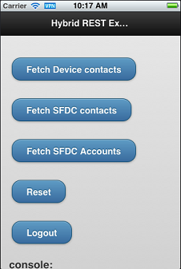
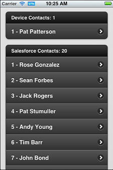

# Running the ContactExplorer Hybrid Sample

Let’s look at the ContactExplorer sample app, which is included in Mobile SDK. ContactExplorer is a hybrid local app that demonstrates more functionality than the template app. You can do this exercise on Mac OS or Windows, but you can fully validate the iOS target only on a Mac.

Before starting this exercise, be sure that you have:

- A directory to contain the `SalesforceMobileSDK-Shared` cloned repo—your root directory, or any other easily accessible location.
- A directory for creating and developing Mobile SDK hybrid projects. Since Cordova projects can contain both iOS and Android targets, it’s a good idea to put them in a platform-neutral directory.

To begin, clone the shared repo, then create an app with forcehybrid.

1.  At a command prompt or Terminal window, `cd` to the directory where you plan to clone the shared repo.
2.  Run the following command.

    ```bash
    git clone https://github.com/forcedotcom/SalesforceMobileSDK-Shared.git
    ```

3.  `cd` to the directory where you plan to develop your hybrid project.
4.  Run `forcehybrid create` with the following values:

    ```bash
    Enter the target platform(s) separated by commas (ios, android): ios,android
    Enter your application type (hybrid_local or hybrid_remote, leave empty for hybrid_local): <PRESS RETURN>
    Enter your application name: contactsApp
    Enter the package name for your app (com.mycompany.myapp): com.acmeapps.contactexplorer
    Enter your organization name (Acme, Inc.): AcmeApps.com
    Enter output directory for your app (leave empty for the current directory): <PRESS RETURN>
    ```

    Now that you have a generic hybrid project, you can add the `contactexplorer` sample code to it.

5.  Run the following commands, making sure to replace the placeholder in the `cp` command with your local path.

    ```bash
    cd contactsApp
    cordova plugin add cordova-plugin-contacts
    cordova plugin add cordova-plugin-statusbar
    cp -RL <LOCAL PATH TO SALESFORCEMOBILESDK-SHARED>/samples/contactexplorer/* www/
    cordova prepare
    ```

    :::note

    _Windows users_: On Windows, substitute the `copy` command for the `cp` Unix command. Be aware, however, that files in the `js` and `css` subfolders of /samples/contactexplorer/ are aliases to source files on other paths. Make sure that you copy the source files themselves rather than their aliases. Here’s an example:

    <!-- cordova plugin remove com.salesforce
    cordova plugin add https://github.com/forcedotcom/SalesforceMobileSDK-CordovaPlugin#v11.1 -\-force-->

    ```bash
    cd contactsApp
    cordova plugin add cordova-plugin-contacts
    cordova plugin add cordova-plugin-statusbar
    rem Make a path variable
    set SHAREDPATH=C:\SalesforceMobileSDK-Shared\
    md www
    cd www
    md css
    copy %SHAREDPATH%\samples\common\jquery.mobile-1.3.1.min.css css
    md js
    copy %SHAREDPATH%\test\MockCordova.js js
    copy %SHAREDPATH%\libs\cordova.force.js js
    copy %SHAREDPATH%\libs\force.js js
    copy %SHAREDPATH%\dependencies\jquery\jquery.min.js js
    copy %SHAREDPATH%\samples\common\jquery.mobile-1.3.1.min.js js
    cordova prepare
    ```

    :::

The forcedroid script and the ensuing commands create an iOS project and an Android project, both of which wrap the ContactExplorer sample app. Now we’re ready to run the app on one of these platforms. If you’re using an iOS device, you must configure a profile for the simulator, as described in the Xcode User Guide at [developer.apple.com/library](http://developer.apple.com/library). Similarly, Android devices must be set up as described at [developer.android.com/tools](http://developer.android.com/tools).

To run the app on iOS:

1.  `cd` to `platforms/ios/`.
2.  Run the following command: `open contactsApp.xcworkspace`
3.  In Xcode, click **Run**.

To run the app on Android:

1.  In Android Studio, import or open the `*<your-hybrid-projects-directory>*/contactsApp/platforms/android` project.
2.  Click **Run**.

When you run the app, after an initial splash screen, you see the Salesforce login screen.


Log in with your Developer Edition org username and password. To allow the app to access your Salesforce data, tap **Allow**. Now that you’re in the app, you can retrieve lists of contacts and accounts. Tap **Fetch SFDC contacts** to retrieve Salesforce contact names or **Fetch SFDC Accounts** to retrieve account names from your DE organization.



With each tap, the app appends rows to an infinite list. Scroll down to see the full list.



Let's take a closer look at how the app works.

::include{src="../../shared/rest_api_using_oauth.md"}
When the device notifies that it’s ready, you call the `force.login()` method to post the login screen.

::include{src="../../shared/forcejs_login.md"}
After completing the login process, the sample app displays `index.html` (located in the www folder). When the page has completed loading and the mobile framework is ready, the `jQuery(document).ready()` function calls` regLinkClickHandlers()`. This function (in `inline.js`) sets up click handlers for the various functions in the sample app. For example, the `#link_fetch_sfdc_contacts` handler runs a query using the `force` object.

<!-- owner=MobileSDK,date="2019-11-05",repo=”SalesforceMobileSDK-Shared”,path=”/samples/contactexplorer/inline.js”,line=16,length=-->

```javascript
$j("#link_fetch_sfdc_contacts").click(function () {
  logToConsole("link_fetch_sfdc_contacts clicked");
  force.query("SELECT Name FROM Contact LIMIT 25", onSuccessSfdcContacts, onErrorSfdc);
});
```

The `force` object is set up during the initial OAuth 2.0 interaction, and gives access to REST API in the context of the authenticated user. Here, we retrieve the names of all the contacts in the DE organization. `onSuccessSfdcContacts()` then renders the contacts as a list on the `index.html` page.

<!-- owner=MobileSDK,date="2019-11-05",repo=”SalesforceMobileSDK-Shared”,path=”/samples/contactexplorer/inline.js”,line=25,length=-->

```javascript
$j("#link_fetch_sfdc_accounts").click(function () {
  logToConsole("link_fetch_sfdc_accounts clicked");
  force.query("SELECT Name FROM Account LIMIT 25", onSuccessSfdcAccounts, onErrorSfdc);
});
```

Similarly to the `#link_fetch_sfdc_contacts` handler, the `#link_fetch_sfdc_accounts` handler fetches Account records via REST API. The `#link_reset` and`#link_logout` handlers clear the displayed lists and log out the user, respectively.

Notice that the app can also retrieve contacts from the device—something that an equivalent web app would be unable to do. The following click handler retrieves device contact query by calling the Cordova contacts plug-in.

<!-- owner=MobileSDK,date="2019-11-05",repo=”SalesforceMobileSDK-Shared”,path=”/samples/contactexplorer/inline.js”,line=6,length=-->

```javascript
$j("#link_fetch_device_contacts").click(function () {
  logToConsole("link_fetch_device_contacts clicked");
  var options = new ContactFindOptions();
  // empty search string returns all contacts
  options.filter = "";
  options.multiple = true;
  options.hasPhoneNumber = true;
  var fields = [navigator.contacts.fieldType.displayName, navigator.contacts.fieldType.name];
  navigator.contacts.find(fields, onSuccessDevice, onErrorDevice, options);
});
```

This handler uses the `ContactFindOptions` and `navigator.contacts` objects from `cordova-plugin-contacts` to refine and execute a search. It calls `navigator.contacts.find()` to retrieve a list of contacts with phone numbers from the device. The `onSuccessDevice()` function (not shown here) renders the contact list into the `index.html` page.

## See Also

- [Build and Run Your Hybrid App On iOS](hybrid-run-ios.md)
- [Build and Run Your Hybrid App on Android](hybrid-run-android.md)
