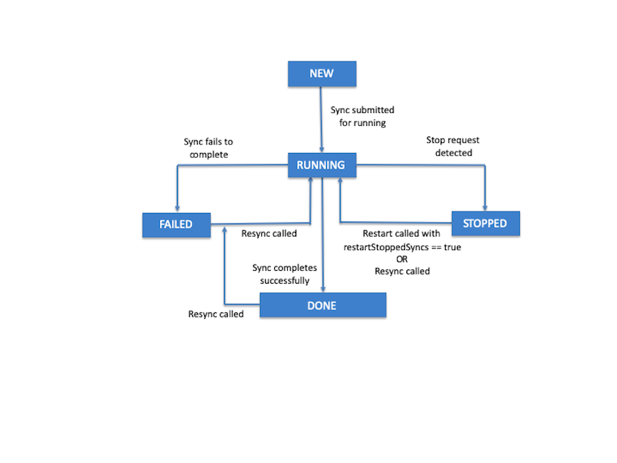

# About Sync Statuses

To enable full control over “in-flight” sync operations, Mobile SDK 7.1 adds a new status that indicates that the operation has been stopped.

Before Mobile SDK 7.1, each sync operation progressed through a cycle of statuses: `new`, `running`, and either `failed` or `done`. Mobile SDK 7.1 adds a `stopped` status to the final step, changing the cycle as follows:

1.  `new`
2.  `running`
3.  `stopped` | `failed` | `done`

When key events occur, sync statuses are updated as follows.

| Event                                                                                                           | Previous Status     | Reported Status |
| --------------------------------------------------------------------------------------------------------------- | ------------------- | --------------- |
| App creates a sync object                                                                                       | —                   | new             |
| Sync object is submitted for running by a call to a sync down or sync up method, or by a first call to `reSync` | new                 | running         |
| Sync operation completes successfully                                                                           | running             | done            |
| Sync operation fails to complete                                                                                | running             | failed          |
| A sync manager stop request is detected                                                                         | running             | stopped         |
| Sync manager restarts with the `restartStoppedSyncs` parameter set to true                                      | stopped             | running         |
| `reSync` is called                                                                                              | stopped/failed/done | running         |



:::note

- Any call to a `reSync` method on a currently running sync operation fails.
- Any call to a `reSync`, `syncDown`, `syncUp`, or `cleanResyncGhosts` method fails if the sync manager state is not in the `accepting_syncs` state.
- If any sync operations are running when the sync manager is first initialized—for example, if the app recently crashed shortly after starting syncs—the sync manager sets their statuses to `stopped`.

:::

## Getting Sync Objects by Status

Beginning with Mobile SDK 7.1, sync manager objects support a `getSyncsWithStatus` method that returns all sync state objects whose status matches a given value. You can use this method, for example, to iterate through all stopped syncs and restart them manually.

:::note

To assume manual restart control over stopped syncs, call the sync manager’s `restart` method with `restartStoppedSyncs` set to false.

:::

**iOS**

- Swift

  - :
    ```nolang
    open class func getSyncsWithStatus(_ store: ,
                                        status: SyncStatus) -> [SyncState]
    ```

- Objective-C

  - :
    ```nolang
    + (NSArray<SFSyncState>) getSyncsWithStatus:(SFSmartStore*)store
                                         status:(SFSyncStateStatus)status;
    ```

**Android (Java)**

```nolang
public static List<SyncState> getSyncsWithStatus( store, Status status)
```
