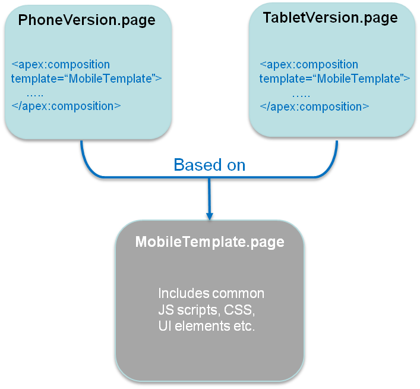

# Multi-Device Strategy

With the worldwide proliferation of mobile devices, HTML5 mobile applications must support a variety of platforms, form factors, and device capabilities. Developers who write device-independent mobile apps in Visualforce face these key design questions:

- Which devices and form factors should my app support?
- How does my app detect various types of devices?
- How should I design a Salesforce application to best support multiple device types?

## Which Devices and Form Factors Should Your App Support?

The answer to this question is dependent on your specific use case and end-user requirements. It is, however, important to spend some time thinking about exactly which devices, platforms, and form factors you do need to support. Where you end up in the spectrum of ‘Support all platforms/devices/form factors’ to ‘Support only desktop and iPhone’ (as an example) plays a major role in how you answer the subsequent two questions.

As can be expected, important trade-offs have to be made when making this decision. Supporting multiple form factors obviously increases the reach for your application. But, it comes at the cost of additional complexity both in terms of initially developing the application, and maintaining it over the long-term.

Developing true cross-device applications is not simply a question of making your web page look (and perform) optimally across different form factors and devices (desktop vs phone vs tablet). You really need to rethink and customize the user experience for each specific device/form factor. The phone or tablet version of your application very often does not need all the bells and whistles supported by your existing desktop-optimized Web page (e.g., uploading files or supporting a use case that requires many distinct clicks).

Conversely, the phone/tablet version of your application can support features like geolocation and taking pictures that are not possible in a desktop environment. There are even significant differences between the phone and tablet versions of the better designed applications like LinkedIn and Flipboard (e.g,. horizontal navigation in a tablet version vs single hand vertical scrolling for a phone version). Think of all these consideration and the associated time and cost it will take you to support them when deciding which devices and form factors to support for your application.

Once you’ve decided which devices to support, you then have to detect which device a particular user is accessing your Web application from.

## Client-Side Detection

The client-side detection approach uses JavaScript (or CSS media queries) running on the client browser to determine the device type. Specifically, you can detect the device type in two different ways.

- **Client-Side Device Detection with the User-Agent Header** — This approach uses JavaScript to parse out the User-Agent HTTP header and determine the device type based on this information. You could of course write your own JavaScript to do this. A better option is to reuse an existing JavaScript. A cursory search of the Internet will result in many reusable JavaScript snippets that can detect the device type based on the User-Agent header. The same cursory search, however, will also expose you to some of the perils of using this approach. The list of all possible User-Agents is huge and ever growing and this is generally considered to be a relatively unreliable method of device detection.
- **Client-Side Device Detection with Screen Size and/or Device Features** — A better alternative to sniffing User-Agent strings in JavaScript is to determine the device type based on the device screen size and or features (e.g., touch enabled). One example of this approach can be found in the open-source Contact Viewer HTML5 mobile app that is built entirely in Visualforce. Specifically, the MobileAppTemplate.page includes a simple JavaScript snippet at the top of the page to distinguish between phone and tablet clients based on the screen size of the device. Another option is to use a library like Device.js or Modernizr to detect the device type. These libraries use some combination of CSS media queries and feature detection (e.g., touch enabled) and are therefore a more reliable option for detecting device type. A simple example that uses the Modernizr library to accomplish this can be found at `http://www.html5rocks.com/static/demos/cross-device/feature/index.html`. A more complete example that uses the `Device.js` library and integrates with Visualforce can be found in this GitHub repo: `https://github.com/sbhanot-sfdc/Visualforce-Device.js`. Here is a snippet from the DesktopVersion.page in that repo.

```visualforce
<apex:page docType="html-5.0" sidebar="false" showHeader="false" standardStylesheets="false" cache="false" >

<head>
  <!-- Every version of your webapp should include a list of all
  versions. -->
  <link rel="alternate" href="/apex/DesktopVersion" id="desktop"
    media="only screen and (touch-enabled: 0)"/>
  <link rel="alternate" href="/apex/PhoneVersion" id="phone"
    media="only screen and (max-device-width: 640px)"/>
  <link rel="alternate" href="/apex/TabletVersion" id="tablet"
    media="only screen and (min-device-width: 641px)"/>

  <meta name="viewport" content="width=device-width, user-scalable=no"/>
  <script src="{!URLFOR($Resource.Device_js)}"/>
</head>

<body>
  <ul>
    <li><a href="?device=phone">Phone Version</a></li>
    <li><a href="?device=tablet">Tablet Version</a></li>
  </ul>
  <h1> This is the Desktop Version</h1>
</body>
</apex:page>
```

The snippet above shows how you can simply include a `<link>` tag for each device type that your application supports. The `Device.js` library then automatically redirects users to the appropriate Visualforce page based on device type detected. There is also a way to override the default Device.js redirect by using the ‘?device=xxx’ format shown above.

## Server-Side Device Detection 

Another option is to detect the device type on the server (i.e., in your Apex controller/extension class). Server-side device detection is based on parsing the User-Agent HTTP header and here is a small code snippet of how you can detect if a Visualforce page is being viewed from an iPhone client.

```visualforce
<apex:page docType="html-5.0"
    sidebar="false"
    showHeader="false"
    cache="false"
    standardStylesheets="false"
    controller="ServerSideDeviceDetection"
    action="{!detectDevice}">
  <h1> This is the Desktop Version</h1>
</apex:page>
```

```apex
public with sharing class ServerSideDeviceDetection {
    public boolean isIPhone {get;set;}
    public ServerSideDeviceDetection() {
         String userAgent = 
                System.currentPageReference().
                    getHeaders().get('User-Agent');
         isIPhone = userAgent.contains('iPhone');
    }
    public PageReference detectDevice(){
        if (isIPhone)
            return Page.PhoneVersion.setRedirect(true);
        else
            return null;    
    }
}
```

Note that User-Agent parsing in the code snippet above is far from comprehensive and you should implement something more robust that detects all the devices that you need to support based on regular expression matching. A good place to start is to look at the RegEx included in the detectmobilebrowsers.com code snippets.

## How Should You Design a Salesforce Application to Best Support Multiple Device Types?

Finally, once you know which devices you need to support and how to distinguish between them, what is the optimal application design for delivering a customized user experiences for each device/form factor? Again, a couple of options to consider.

For simple applications where all you need is for the same Visualforce page to display well across different form factors, a responsive design approach is an attractive option. In a nutshell, Responsive design uses CCS3 media queries to dynamically reformat a page to fit the form factor of the client browser. You could even use a responsive design framework like Twitter Bootstrap to achieve this.

Another option is to design multiple Visualforce pages, each optimized for a specific form factor and then redirect users to the appropriate page using one of the strategies described in the previous section. Note that having separate Visualforce pages does not, and should not, imply code/functionality duplication. A well architected solution can maximize code reuse both on the client-side (by using Visualforce strategies like Components, Templates etc.) as well as the server-side (e.g., encapsulating common business logic in an Apex class that gets called by multiple page controllers). An excellent example of such a design can be found in the same open-source  Contact Viewer application referenced before. Though the application has separate pages for its phone and tablet version (`ContactsAppMobile.page` and `ContactsApp.page` respectively), they both share a common template (`MobileAppTemplate.page`), thus maximizing code and artifact reuse. The figure below is a conceptual representation of the design for the Contact Viewer application.



Lastly, it is also possible to service multiple form factors from a single Visualforce page by doing server-side device detection and making use of the ‘rendered’ attribute available in most Visualforce components (or more directly, the CSS ‘display:none/block’ property on a \<div> tag) to selectively show/hide page elements.  This approach however can result in bloated and hard-to-maintain code and should be used sparingly.
