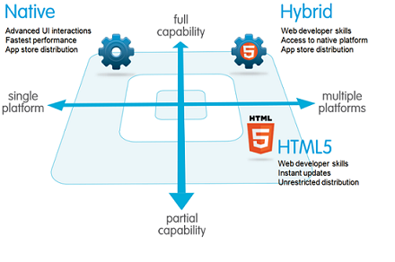

# About Native, HTML, and Hybrid Development

Salesforce Mobile SDK gives you options for developing your app. You can choose the options that fit your development skills, device and technology requirements, goals, and schedule.

With Mobile SDK, you can choose the development platform that best fits your business needs and resources. These platforms include:

- Native
- HTML Living Standard
- Hybrid
- React Native

Each platform option supports both iOS and Android. Use the following descriptions to get a sense of which option best suits your requirements.

<!-- No source is available for this old chart. React Native needs to be added. Until we can recreate the diagram, I’m hiding it.

-->

## Native Apps

Native apps are specific to a given mobile platform (iOS or Android). These apps use the development tools and languages that the respective platform supports. For example, you develop iOS apps in Xcode using Swift or Objective-C. Of all app types, native apps look and perform best. They provide the best usability, the best features, and the best overall mobile experience. For example, native is the best choice for delivering the following features:

- **Fast graphics API**—The native platform gives you the fastest graphics. This advantage helps, for example, if you’re using large quantities of data and require a fast refresh.
- **Fluid animation**—Related to the fast graphics API is the ability to have fluid animation. This ability is especially important in mobile apps for UI graphics and video streaming.
- **Built-in components**—The camera, contacts, geolocation, and other features native to the device can be seamlessly integrated into mobile apps. Another important built-in component is encrypted storage.
- **Ease of use**—The native platform is what people are accustomed to. When you add that familiarity to the native features they expect, your app becomes that much easier to use.

Native app development requires an integrated development environment (IDE). IDEs provide rich platform-specific tools for building and debugging code, project management, version control, and other necessities. While the required level of experience is higher than for other development scenarios, the levels of control and freedom are also higher. Other benefits of native development can include:

- Proven APIs and frameworks give you confidence that your efforts are worthwhile
- Established components that define standard behaviors like navigation, tabs, and modal dialogs
- Source control that allows you to maintain all your code in one secure place

## HTML Apps

HTML apps (also known as HTML5 apps) use standard web technologies—typically the HTML Living Standard, JavaScript, and CSS—to deliver web pages to a mobile browser. Getting started with ubiquitous HTML standards and tools is easier than adopting native compilers or hybrid frameworks.

HTML development creates multi-platform mobile apps that are device agnostic and can run on any modern mobile browser. Responsive web design automatically adapts your content to various screen sizes and resolutions, thus reducing your testing requirements. The HTML “write once, run anywhere” approach minimizes distribution efforts: Push a bug fix or new feature to the production server, and it’s instantly available to all users. And because your content is on the web, it’s search enabled—a major benefit for many types of apps.

If HTML apps are easy to develop and support and can reach a wide range of devices, what are the drawbacks?

- **No secure offline storage**—HTML browsers support offline databases and caching, but with no standard encryption support. Mobile SDK offers all of these features.
- **Unfriendly security flows**—Trivial security measures can pose complex implementation challenges in mobile web apps. They can also be painful for users. For example, some web apps with authentication require users to reenter their credentials every time the app restarts or returns from a background state.
- **Limited native features**—Support for camera, contacts, and other native features can vary, especially among older mobile browsers.
- **Lack of native look and feel**—HTML can only emulate the native look, and customers can’t use familiar compound gestures.

## Hybrid Apps

Hybrid apps combine the ease of HTML coding with the power of the native platform. The resulting application can access the device’s native capabilities and is distributed through the App Store. You can also create hybrid apps that deliver Lightning web components or Visualforce pages.

Hybrid apps wrap HTML, JavaScript, and CSS code inside a lightweight native container that provides access to native platform features. Generally, hybrid apps provide the best of both HTML and native worlds. They’re almost as easy to develop as HTML apps and access native functionality through JavaScript APIs. In addition, hybrid apps can use the Mobile SDK offline features to

- Model, query, search, and edit Salesforce data.
- Securely cache Salesforce data for offline use.
- Synchronize locally cached data with the Salesforce server.

Unlike HTML apps, hybrid apps are downloaded and installed on mobile devices. Perhaps you’re wondering whether hybrid apps store their files on the device or on a server. Great question! The storage location depends on whether the hybrid app is local or remote.

- Local

  - : You can package HTML and JavaScript code inside the mobile application binary, in a structure similar to a native application. You use REST APIs and Ajax to move data back and forth between the device and the cloud.

- Remote

  - : Alternatively, you can implement the full web application from the server (with optional caching for better performance). Your container app retrieves the full application from the server and displays it in a native web view.

In addition, hybrid remote apps can host Lightning web components. Hybrid is the only Mobile SDK platform that currently supports these popular Salesforce entities.

## React Native Apps

React Native apps use the React Native framework from Facebook, Inc., to run JavaScript apps as native code. Rather than following the hybrid paradigm, React Native lets you assemble the native UI building blocks with JavaScript code. This framework provides direct access to native resources and lets you test without recompiling. In performance terms, React Native runs a close second to pure native execution.

React Native apps use specialized scripting languages.

- JavaScript is ES2015.
- CSS is JavaScript code that closely resembles CSS syntax and is typically written inline in your JavaScript app.
- Markup is actually a special flavor of XML named JSX. Unlike HTML, which embeds JavaScript in markup, you embed JSX markup in JavaScript.
- TypeScript support lets you use non-binding static typing in your JavaScript code.

In addition, React Native bridges provide access to standard Mobile SDK features, such as:

- SmartStore
- Mobile Sync
- Salesforce login and authentication
- Salesforce REST API access.

You can even access your own native objects—in Swift, Objective-C, or Java—directly in React Native code.

## Mobile Architecture Comparison

The following table shows how the various development scenarios stack up.

|                                     | Native, React Native                                                                | HTML                                     | Hybrid                                                    |
| ----------------------------------- | ----------------------------------------------------------------------------------- | ---------------------------------------- | --------------------------------------------------------- |
| **Graphics**                        | Native APIs                                                                         | HTML, Canvas, SVG                        | HTML, SVG                                                 |
| **Performance**                     | Fastest                                                                             | Fast                                     | Moderately fast                                           |
| **Look and feel**                   | Native                                                                              | Emulated                                 | Emulated                                                  |
| **Distribution**                    | App Store, Google Play                                                              | Web                                      | App Store, Google Play                                    |
| **Camera**                          | Yes                                                                                 | Browser dependent                        | Yes                                                       |
| **Notifications (from Salesforce)** | Yes                                                                                 | No                                       | Yes                                                       |
| **Contacts, calendar**              | Yes                                                                                 | Browser dependent                        | Yes                                                       |
| **Offline storage**                 | Secure file system                                                                  | Not secure; shared SQL, Key-Value stores | Secure file system; shared SQL (through Cordova plug-ins) |
| **Geolocation**                     | Yes                                                                                 | Yes                                      | Yes                                                       |
| **Swipe**                           | Yes                                                                                 | Yes                                      | Yes                                                       |
| **Pinch, spread**                   | Yes                                                                                 | Yes                                      | Yes                                                       |
| **Connectivity**                    | Online, offline                                                                     | Mostly online                            | Online, offline                                           |
| **Development skills**              | Swift, Objective-C, Java, Kotlin; JavaScript/TypeScript, markup (React Native only) | HTML, CSS, JavaScript                    | HTML, CSS, JavaScript                                     |
