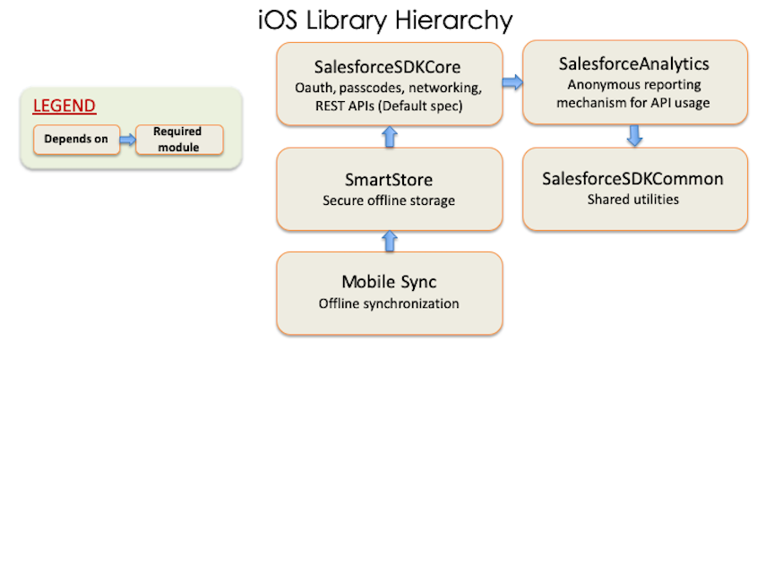

# Use CocoaPods with Mobile SDK

CocoaPods provides a convenient mechanism for merging Mobile SDK modules into existing Xcode projects. The steps in this article guide you through manually setting up CocoaPods in a Mobile SDK iOS app. If you created your app with forceios 4.0 or later, you get the CocoaPods setup automatically. In that case, you don’t have to perform the steps in this article—you only have to install CocoaPods software, and forceios does the rest. If you’re creating apps some other way, use this article if you plan to import Mobile SDK modules through CocoaPods.

In Mobile SDK 4.0 and later, forceios uses CocoaPods to create projects. Developers can also use CocoaPods manually to add Mobile SDK to existing iOS apps.

If you’re unfamiliar with CocoaPods, start by reading the documentation at [www.cocoapods.org](http://cocoapods.org).

:::note

The forceios npm utility is provided as an optional convenience. CocoaPods, node.js, and npm are required for forceios but are not required for Mobile SDK iOS development. They’re also required for forcehybrid when generating a hybrid app for iOS. To learn how to create Mobile SDK iOS native projects without forceios, see [Creating an iOS Swift Project Manually](ios-new-native-project-manual.md).

:::

Mobile SDK provides CocoaPods pod specifications, or podspecs, for each Mobile SDK module.

- `SalesforceSDKCore`—Implements OAuth, passcodes, networking, and REST APIs.
- `SmartStore`—Implements secure offline storage. Depends on `SalesforceSDKCore`.
- `Mobile Sync`—Implements offline synchronization. Depends on `SmartStore`.
- `SalesforceAnalytics`—Implements a reporting mechanism that sends Salesforce anonymous statistics on Mobile SDK feature usage and popularity.
- `SalesforceSDKCommon`—Utilities shared throughout the SDK.

Mobile SDK also consumes FMDB, an external module, through CocoaPods.

The following chart shows the dependencies between specs. In this chart, the arrows point from the dependent specs to their dependencies.



If you declare a pod, you automatically get everything in that pod’s dependency chain. For example, by declaring a pod for Mobile Sync, you automatically get the `SmartStore` and `SalesforceSDKCore` pods. This shortcut applies only to production pods.

You can access all versions of the Mobile SDK podspecs in the [github.com/forcedotcom/SalesforceMobileSDK-iOS-Specs](https://github.com/forcedotcom/SalesforceMobileSDK-iOS-Specs) repo. You can also get the current version from the [github.com/forcedotcom/SalesforceMobileSDK-iOS](https://github.com/forcedotcom/SalesforceMobileSDK-iOS) repo.

To use CocoaPods with the current Mobile SDK release, follow these steps.

1.  Be sure you’ve installed the `cocoapods` Ruby gem as described at [www.cocoapods.org](http://www.cocoapods.org). Mobile SDK 11.1 accepts pod versions 1.8 to no declared maximum.

2.  In your project's Podfile, add the SalesforceMobileSDK-iOS-Specs repo as a source. Make sure that you put this entry first, before the CocoaPods source path.

    ```nolang
    target 'YourAppName' do
    source 'https://github.com/forcedotcom/SalesforceMobileSDK-iOS-Specs.git' # needs to be first
    source 'https://github.com/CocoaPods/Specs.git'
    ...
    ```

3.  Reference the Mobile SDK podspec that you intend to merge into your app. For example, to add OAuth and passcode modules to your app, declare the `SalesforceSDKCore` pod in your Podfile. For example:

    ```nolang
    target 'YourAppName' do
    source 'https://github.com/forcedotcom/SalesforceMobileSDK-iOS-Specs.git' # needs to be first
    source 'https://github.com/CocoaPods/Specs.git'

    pod 'SalesforceSDKCore'

    end

    ```

    This pod configuration is the minimum for a Mobile SDK app.

4.  To add other modules, replace `SalesforceSDKCore` with a different pod declaration. For example, to use Mobile Sync:

    ```nolang
    target 'YourAppName' do
    source 'https://github.com/forcedotcom/SalesforceMobileSDK-iOS-Specs.git' # needs to be first
    source 'https://github.com/CocoaPods/Specs.git'

    pod 'MobileSync'

    end
    ```

    Since the `MobileSync` pod depends on `SmartStore` and `SalesforceSDKCore`, you don’t need to declare those pods explicitly.

5.  (Alternate method) To work with the upcoming release of Mobile SDK, you clone the SalesforceMobileSDK-iOS repo, check out the `dev` branch, and then pull resources from it. In this case, you must declare each pre-release dependency explicitly so you can indicate its repo path. If you omit a dependency declaration, CocoaPods loads its production version.

    1.  Clone [github.com/forcedotcom/SalesforceMobileSDK-iOS](https://github.com/forcedotcom/SalesforceMobileSDK-iOS-Specs) locally at the desired commit.

    2.  At the Terminal window, run `git checkout dev` to switch to the development branch.

    3.  Run `./install.sh` in the root directory of your clone.

    4.  To each pod call in your Podfile, add a `:path` parameter that points to your clone.

    Here's the previous example repurposed to pull resources from a local clone:

    ```nolang
    target 'YourAppName' do
    source 'https://github.com/forcedotcom/SalesforceMobileSDK-iOS-Specs.git' # need to be first
    source 'https://github.com/CocoaPods/Specs.git'

    # Specify each pre-release pod
    pod 'SalesforceSDKCore', :path => '/<PATH-TO-CLONE-OF>/SalesforceMobileSDK-iOS/'
    pod 'SalesforceAnalytics', :path => '/<PATH-TO-CLONE-OF>/SalesforceMobileSDK-iOS/'
    pod '', :path => '/<PATH-TO-CLONE-OF>/SalesforceMobileSDK-iOS/'
    pod 'MobileSync', :path => '/<PATH-TO-CLONE-OF>/SalesforceMobileSDK-iOS/'

    end
    ```

6.  In a Terminal window, run `pod install` from your project directory. CocoaPods downloads the dependencies for your requested pods, merges them into your project, and creates a workspace containing the newly merged project.

    :::important

    After running CocoaPods, always access your project only from the workspace that `pod install` creates. For example, instead of opening `MyProject.xcodeproj`, open `MyProject.xcworkspace`.

    :::

7.  To use Mobile SDK APIs in your merged app, remember these important tips.

    1.  In Objective-C apps, import header files using angle brackets (“\<” and “>”) rather than double quotes. For example:

        ```nolang
        #import <SalesforceSDKCore/SFRestAPI.h>
        ```

    2.  In Swift apps, be sure to specify `use_frameworks!` in your Podfile. Also, in your Swift source files, remember to import modules instead of header files. For example:

        ```nolang
        import SalesforceSDKCore
        ```
