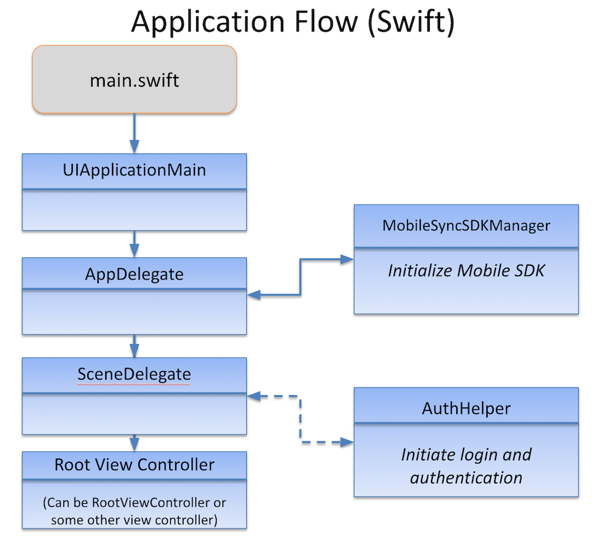
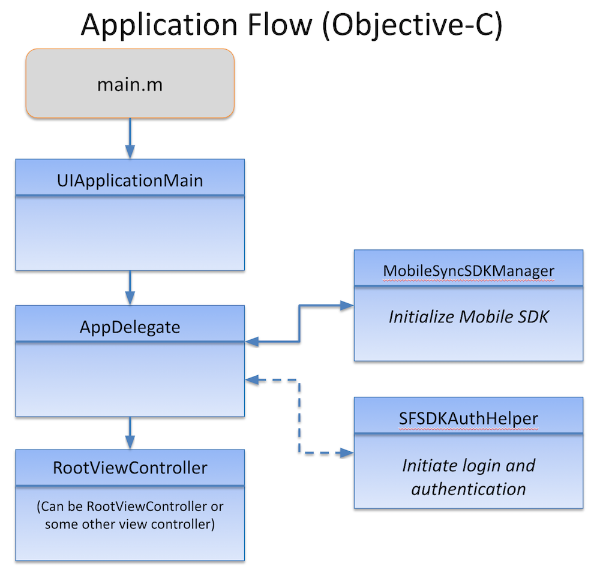

# Overview of Application Flow

Native iOS apps for Mobile SDK, whether Objective-C and Swift, follow similar designs. The `main.swift` source file (`main.m` in Objective-C) creates a `UIApplicationMain` object that is the root object for the rest of the application. The `UIApplicationMain` constructor instantiates the Mobile SDK `SFApplication` object and spawns an `AppDelegate` object that manages the application lifecycle.

`AppDelegate` uses a Mobile SDK service object, `SalesforceSDKManager`, to initialize SDK objects. After successful initialization, the Objective-C and Swift flows diverge slightly.

## Swift Flow

The native iOS Swift template for Mobile SDK defines four main classes: `AppDelegate`, `InitialViewController`, `SceneDelegate`, and a root view controller. The `AppDelegate` object calls `SalesforceSDKManager` or one of its extensions to initialize the SDK. It then passes control to a `SceneDelegate` instance. When a new scene is about to enter the foreground, `SceneDelegate` loads `InitialViewController`—an empty `UIViewController` object that’s a container for the Salesforce login and authorization screens. `SceneDelegate` then calls `AuthHelper` to begin the authentication process if necessary. After authentication succeeds, `SceneDelegate` launches your app by passing control to its custom root view controller. For this template, the root view controller is the `AccountsListView` class.

## Objective-C Flow

The Objective-C native iOS template defines three classes: `AppDelegate`, `InitialViewController`, and `RootViewController`. The `AppDelegate` object calls `SFSDKAuthHelper` to load `InitialViewController` for its first view—the login screen. After authentication succeeds, the `AppDelegate` object displays the view associated with `RootViewController` as the entry point to your app.

:::note

The workflow demonstrated by the template app is just an example. You can tailor your `AppDelegate` and supporting classes to enable extra features or refine the workflow. For example, you can postpone Salesforce authentication until it’s required. You can retrieve data through REST API calls and display it, launch other views, perform services, and so on. Mobile SDK templates also provide commented-out boilerplate code that you can reinstate to handle push notifications and initialize IDP app services.

:::

**See Also**

- [SDK Manager Classes](salesforce-sdk-manager-ios.md)
