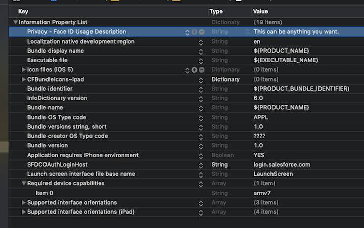

# About Login and Passcodes

To access Salesforce objects from a Mobile SDK app, the customer logs in to a Salesforce org. When the login flow begins, Mobile SDK sends the app’s connected app configuration to Salesforce. Salesforce responds by posting a login screen to the mobile device.

Optionally, a Salesforce administrator can set the connected app to require a passcode after login. This setting, for example, requires a backgrounded app to prompt for a passcode when it returns to the foreground. When the connected app requires a mobile app passcode, Mobile SDK 9.2 and later use the device system passcode.

To verify a required passcode, Mobile SDK presents a lock screen that uses the customer’s configured verification mode—for example, touch ID, face ID, or direct passcode entry. If no device passcode has been set, Mobile SDK prompts the customer to visit the iOS Settings interface and create one. If the connected app doesn’t require a mobile passcode, Mobile SDK skips the passcode verification step. Mobile SDK handles all login and passcode lock screens and the authentication handshake.

## Mobile Passcode Policies

Each Mobile SDK app hard-codes a connected app’s consumer key and OAuth callback URL from a specific Salesforce org. Mobile SDK honors the configurable passcode requirement in that org’s designated connected app. <!-- Edits go somewhere around here.-->Beginning in version 9.2, Mobile SDK ignores org settings such as PIN length, and instead relies on device configuration. Similarly, incorrect passcode entries are handled according to the standard procedure of the mobile operating system.

:::note

Beginning in version 9.2, Mobile SDK ignored the **Lock App After** setting in the org’s Connected App, in favor of the device’s configuration for locking the device after it’s been idle. In version 10.1.1 and later, Mobile SDK again respects the **Lock App After** Connected App setting. When set, the mobile app locks after it has been in the background for longer than the timeout period. Locking occurs when the mobile app is activated. Unlocking the app remains the same.

:::

If a customer uses the app to log into a different org, Mobile SDK can’t retrieve the designated connected app settings. Therefore, that customer never encounters the passcode prompt.

## Multi-User Behavior of the Lock Screen

When multiple users are logged into the same app on the same device, the lock screen behaves as follows.

1.  When resuming an app that requires passcode, the customer is first prompted by a lock screen to authenticate through the mobile operating system.
2.  If the customer cancels authentication, **Logout** and **Retry Unlock** buttons appear on the lock screen.
3.  The **Logout** button works only for customers that require the lock screen.
4.  If the last user that requires the lock screen logs out, Mobile SDK no longer shows the lock screen.

## Using Biometric Identification

By default, Mobile SDK supports the use of Touch ID and Face ID for passcode verification. Customers can set their preference for biometric or any other iOS input mode in Settings.

Biometric identification requires the following app configuration.

- App Configuration

  - :

    1.  Open your app’s information property list (plist) file.
    2.  Add the following top-level property:

        - Key: **NSFaceIDUsageDescription** (labeled “Privacy - Face ID Usage Description”)
        - Value: **\<_Enter any string_>** (for example, “Use Face ID to avoid retyping your PIN”)

        

## Disabling Biometric Identification

Apps built with Mobile SDK 9.2 and later ignore biometric settings from Salesforce connected apps. Instead, customers can configure the authentication mode themselves in device settings.

## See Also

- [About PIN Security](connected-apps-security-pin.md)
- [OAuth 2.0 Authentication Flow](oauth-intro-flow.md)
- [Biometric Authentication](biometric-auth.md)
