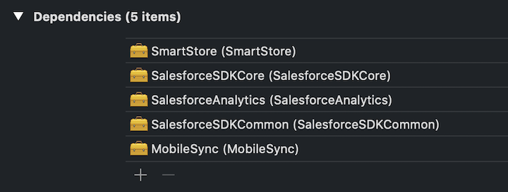
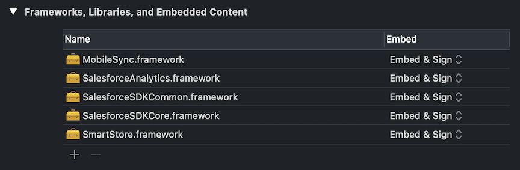

# Configure Your Project’s Build Settings

:::important

Where possible, we changed noninclusive terms to align with our company value of Equality. We maintained certain terms to avoid any effect on customer implementations.

:::

## Prerequisites

1.  [Create an Xcode Swift Project](ios-new-native-manual-create-xcode-project.md)
2.  [Add Mobile SDK Libraries to Your Project](ios-new-native-manual-clone-sdk.md)

## Customize Your Project’s Build Configuration

1.  In Project Navigator, select the top-level project.
2.  In the Project Editor, select **Build Phases**.
3.  Under **Dependencies**, click **Add Items** (**+**).
4.  Use Command+Click to multi-select the gold briefcase icons for all five Mobile SDK libraries, then click **Add**.

    When you’ve finished, you see the following:

    

5.  In the Project Editor, select **General**.
6.  Scroll to **Frameworks, Binaries, and Embedded Content**.
7.  Click **Add items** (**+**) and add the following frameworks:

    - `SalesforceSDKCommon.framework`
    - `SalesforceAnalytics.framework`
    - `SalesforceSDKCore.framework`
    - `SmartStore.framework`
    - `MobileSync.framework`

    

    :::important

    Be sure to add each framework only once. If you accidentally add duplicates, select the extraneous ones and click **Remove items** (**-**).

    :::

    <!--
    1.  In the Project Editor, select **Build Settings**.
    2.  In the local Search field, type “Swift Language Version”.
    3.  Set **Swift Language Version** to **Swift 5**. -->

8.  Run a test build.

    :::note

    - The result of this build isn’t a functional Mobile SDK app. You’re only checking to see if the libraries built properly. When the app runs, you still see just a blank white screen that says “Hello, world!”
    - If you get a warning about a missing image file:

    1. In Terminal, navigate to `<*your selected local path*>/MyMobileSDKApp/SalesforceMobileSDK-iOS/`
    2. Run `./install.sh`
       :::

9.  In Xcode, click **Stop**.

At this point, Mobile SDK is available in your app, but your app can’t yet use it. Using Mobile SDK requires coding to initialize the SDK and integrate its services into your app’s sessions. To finish setting up Mobile SDK, you have a choice of two options:

- [Option 1: Import Mobile SDK Template Files](ios-new-native-manual-details.md)

  - : This option is the quicker, easier route. In your project you remove certain Xcode template files and add files from the [iOS native Swift template](https://github.com/forcedotcom/SalesforceMobileSDK-Templates/tree/master/iOSNativeSwiftTemplate). Voilà! Your app is ready to use Mobile SDK.

- [Option 2: Add Mobile SDK Setup Code Manually](ios-new-native-no-template.md)

  - : This hands-on coding option gives you a front-row seat to the code changes required for Mobile SDK integration. Along the way, you also might discover some useful customization opportunities. This option doesn’t ask you to import template files into your project. However, you’ll still benefit from copying a few boilerplate functions found in the [iOS native Swift template](https://github.com/forcedotcom/SalesforceMobileSDK-Templates/tree/master/iOSNativeSwiftTemplate).
