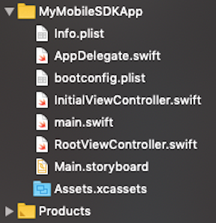
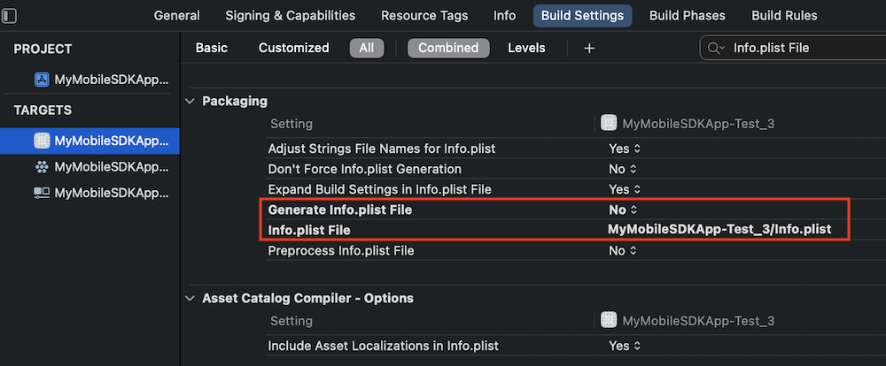

# Option 1: Import Mobile SDK Template Files

In this option, you replace files from the Xcode Swift template with files from the Mobile SDK native Swift template—work that otherwise would be done by forceios. A few drags and drops, and the app is ready to connect to Salesforce and display org data.

:::important

Where possible, we changed noninclusive terms to align with our company value of Equality. We maintained certain terms to avoid any effect on customer implementations.

:::

## Prerequisites

1.  [Create an Xcode Swift Project](ios-new-native-manual-create-xcode-project.md)
2.  [Add Mobile SDK Libraries to Your Project](ios-new-native-manual-clone-sdk.md)
3.  [Configure Your Project’s Build Settings](ios-new-native-manual-configure-build.md)

## Add Mobile SDK Code Assets

1.  In Xcode, open the `MyMobileSDKApp/MyMobileSDKApp` project folder.
2.  Select all files _except_ the `Assets.xcassets` and `Preview Content` folders.<!-- What about the two storyboards? SceneDelegate.swift, Main.storyboard, LaunchScreen.storyboard-->
3.  Control-Click and select **Delete**.
4.  Select **Move to Trash**.
5.  In Finder, navigate to your SalesforceMobileSDK-Templates clone and expand its `/iOSNativeSwiftTemplate/iOSNativeSwiftTemplate/` subfolder.
6.  Drag the following Swift template files into Xcode’s Project Navigator. Drop them in your project’s `MyMobileSDKApp/MyMobileSDKApp/` folder. <!-- [SCREENSHOT]:-->
    - `AccountsListModel.swift`
    - `AccountsListView.swift`
    - `AppDelegate.swift`
    - `bootconfig.plist`
    - `Bridging-Header.h`
    - `ContactDetailModel.swift`
    - `ContactDetailsView.swift`
    - `ContactsForAccountListView.swift`
    - `ContactsForAccountModel.swift`
    - `Info.plist`
    - `InitialViewController.swift`
    - `main.swift`
    - `iOSNativeSwiftTemplate.entitlements`
    - `SceneDelegate.swift`
    - `userstore.json`
    - `usersyncs.json`
7.  Select the following:

    | Option          | Value                        |
    | --------------- | ---------------------------- |
    | Destination:    | **Copy items if needed**     |
    | Added folders:  | **Create folder references** |
    | Add to targets: | **MyMobileSDKApp**           |

8.  If Xcode asks for permission to create an Objective-C bridging header, click **Don’t Create**.
9.  In your Project settings, select **Build Phases**.
10. Under Copy Bundle Resources, select `Info.plist` if it’s present and click **Remove Items** (-).
    <!-- Here’s how your project looks after you’ve added the Mobile SDK files. -->
11. _Xcode 13 only_:

    - In **Build Settings**, search for “Info.plist File”.
    - Set **Generate Info.plist File** to **No**.
    - Set **Info.plist File** to “MyMobileSDKApp/Info.plist”.

    

For more information on the template files, see [Overview of Application Flow](ios-native-application-flow.md).

## Build Your New Mobile SDK App

1.  Select your top-level project.
2.  Your project is ready to build. Select **Product** | **Run**.
3.  If the Salesforce login screen appears, you’re done!

Your new project is ready for customization. You can now add your own assets, customize the `AppDelegate.swift` and `SceneDelegate.swift` classes, and do as you like with the Accounts and Contacts functionality.

:::important

Before posting your app to the App Store, be sure to update the `remoteAccessConsumerKey` and `oauthRedirectURI` in the `bootconfig.plist` file with settings from your connected app. See [Get Started with Native iOS Development](https://trailhead.salesforce.com/content/learn/modules/mobile_sdk_native_ios/mobilesdk_ios_getting_started?trail_id=mobile_sdk_intro).

:::
