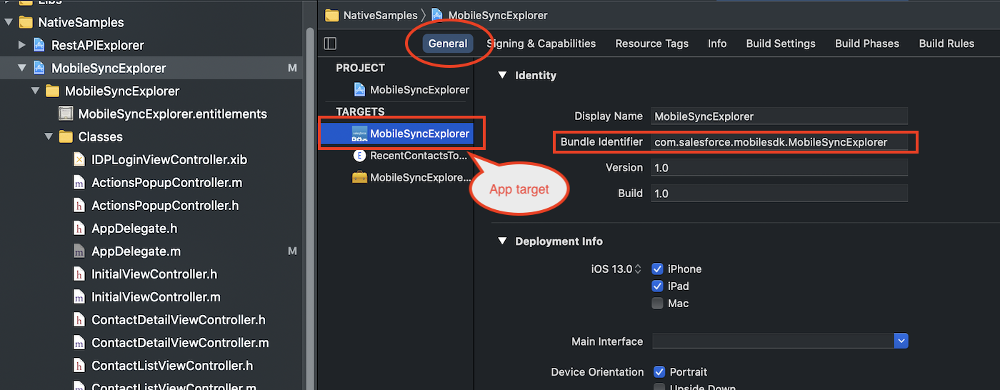
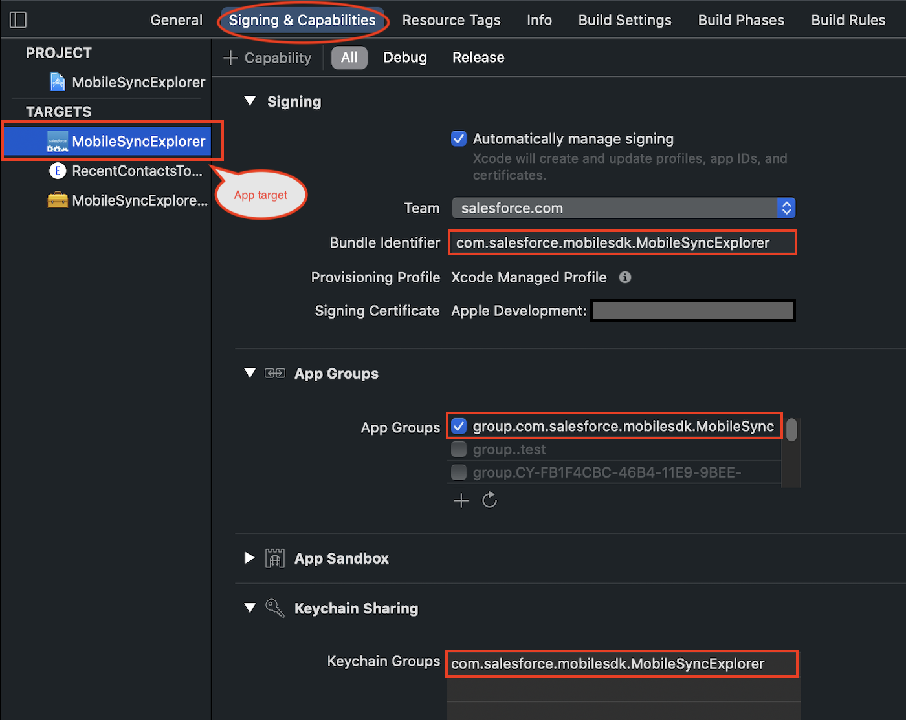
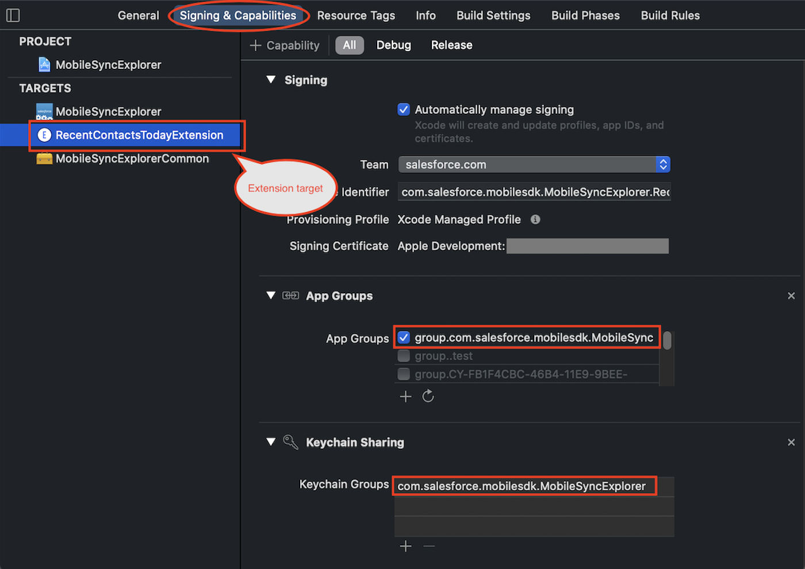

# Using iOS App Extensions with Mobile SDK

iOS app extensions provide opportunities for developers to extend their app’s functionality beyond the app window. Mobile SDK supports app extensions with only a small amount of extra configuration.

## About iOS App Extensions in Mobile SDK Apps

An iOS app extension is a separate target in your project. It lives in its own folder and is added to your app bundle as a separate binary unit. However, the app extension can access the same resources and libraries as your main app. Apple offers many extension types, as described in App Extensions articles at [developer.apple.com](https://developer.apple.com).

To enable extensions, you add special configuration in two areas:

- **Project settings:** When you add an app extension, Xcode creates an app extension build target. You configure the existing main target and the new extension target to join the same app group and keychain sharing group. Both apps must sign in to the same provisioning profile.
- **Application code:** At runtime, the two apps must use identical app group information, and the main app must convey user authentication status to the extension.

After everything is properly configured, your app extension can run any Mobile SDK code that’s appropriate for the extension type.

:::note

You can reliably test app extensions only on physical devices. Simulator tests can give unpredictable results.

:::

## Project Settings

1.  In your Mobile SDK app, create an extension target as described in the Apple developer documentation. How you handle this step and the type of extension is between you and iOS.
2.  After you’ve created the target, select the top-level node of your Mobile SDK workspace in the Xcode Project Navigator. This step opens your project in the Project Editor.
3.  In both app and extension targets, sign in to the same developer team.
4.  Click **General**, and then specify a unique bundle identifier for the app target. Here’s how it looks in Xcode 12.4: 
5.  Repeat the bundle identifier step for the extension target. This identifier must also be unique.
6.  In your app configuration, select your Mobile SDK app target and then click **Capabilities**.
7.  Turn on **App Groups** and **Keychain Sharing** in your app target.
8.  Under **App Groups**, select or create an app group. Use a unique label that identifies your app, such as “group.myapp.shared”.
9.  Under **Keychain Sharing**, select or create a keychain group. Use a unique label that identifies your app, such as “com.myapp.MyApp”. 
10. Repeat the App Groups and Keychain Sharing steps for your extension target. The two values in the extension target must exactly match the corresponding values in the application target. 

## App Group Settings

When you incorporate an iOS app extension into a forceios app, you add code that tells Mobile SDK that you’re working in an app group. You add these lines in two places: the `AppDelegate` class in your main app, and the view controller or scene delegate class in your app extension.

Mobile SDK provides a utility class, `SFSDKDatasharingHelper`, that stores the necessary properties. Values you set for these properties in the main app and the app extension must be identical.

After the user attempts to log in to Salesforce, you store the authentication status where the extension code can access it. To do so, use an `NSUserDefaults` dictionary whose suite name matches your app group name. Mobile SDK provides a `NSUserDefaults (SFAdditions)` category that provides such a dictionary. This category defines one class method, `msdkUserDefaults`, that returns a group dictionary if the `appGroupEnabled` flag of the singleton `SFSDKDatasharingHelper` object is set to YES. Here’s the SDK category:

```swift
@implementation NSUserDefaults (SFAdditions)

+ (NSUserDefaults *)msdkUserDefaults {
    NSUserDefaults *sharedDefaults = nil;
    if ([SFSDKDatasharingHelper sharedInstance].appGroupEnabled) {
        sharedDefaults = [[NSUserDefaults alloc]
            initWithSuiteName:[SFSDKDatasharingHelper sharedInstance].appGroupName];
    } else {
        sharedDefaults = [NSUserDefaults standardUserDefaults];
    }
    return sharedDefaults;
}

@end
```

## AppDelegate Code Changes

The following steps apply to the `init` method of your main app’s `AppDelegate` class.

1.  At the top of the `init` method, set `appGroupName` and `appGroupEnabled` on the `SFSDKDatasharingHelper` shared instance.

    ```swift
    ...
    - (id)init
    {
        self = [super init];
        if (self) {
         // Insert these two lines, using your app group name
            [SFSDKDatasharingHelper sharedInstance].appGroupName =
                @"<YOUR APP GROUP NAME>";
            [SFSDKDatasharingHelper sharedInstance].appGroupEnabled = YES;
    ...

    ```

2.  After the user has successfully logged in, store a value reflecting the login status in an object that the extension code can access. You can infer the status by reading the `currentUser` property of the `SFUserAccountManager` object. To safely and consistently update the login status, set this property in the callback method of the `registerBlockForCurrentUserChangeNotifications` call in the `init` method. The following example uses the Mobile SDK `NSUserDefaults (SFAdditions)` category to store the Boolean value under a key named `userLoggedIn`.

    ```swift
    [SFSDKAuthHelper registerBlockForCurrentUserChangeNotifications:^{
        __strong typeof (weakSelf) strongSelf = weakSelf;
        BOOL loggedIn = [SFUserAccountManager.sharedInstance currentUser] != nil;
        [[NSUserDefaults msdkUserDefaults] setBool:loggedIn forKey:@"userLoggedIn"];
        [strongSelf resetViewState:^{
            [strongSelf setupRootViewController];
        }];
    }];
    ```

## App Extension Code Changes

At runtime, your iOS app extension operates as a second app, so you have to “bootstrap” it as well. You apply the same `appGroupName` and `appGroupEnabled` changes as you did in the main app’s `AppDelegate` class.

App extensions can’t perform authentication tasks such as user logins. However, before making calls to a Mobile SDK manager such as `MobileSyncSDKManager`, you must verify that a user has logged in. You do this verification by checking the value stored by the main app in the `NSUserDefaults` dictionary.

1.  In your app extension’s initialization entry point, set and enable the app group.

    ```swift
    [SFSDKDatasharingHelper sharedInstance].appGroupName = @"<YOUR APP GROUP NAME>";
    [SFSDKDatasharingHelper sharedInstance].appGroupEnabled = YES;

    ```

2.  Verify that the `userLoggedIn` value indicates success. Continue with other Mobile SDK calls only if `userLoggedIn` equals YES.

If the app determines that a user has successfully logged in, the app extension can apply that user’s shared credentials to Salesforce API calls.

:::important

- It’s the developer’s responsibility to determine the user’s login status. The iOS app extension code must not attempt to invoke the `SalesforceSDKManager` object before the user successfully logs in.

:::

## Example

The following code is taken from the [MobileSyncExplorer native sample app](https://github.com/forcedotcom/SalesforceMobileSDK-iOS/tree/dev/native/SampleApps/MobileSyncExplorer). This sample defines an app extension that displays a list of MRU Contact records.

Besides the app and extension targets, the MobileSyncExplorer project defines a third target, `MobileSyncExplorerCommon`. This container module is accessible in main and extension targets but isn’t part of the app group. It implements a `MobileSyncExplorerConfig` class that declares and manages three properties:

- appGroupName

  - : The “app group” name, as defined in the project settings. This string is also hard-coded in the `MobileSyncExplorerConfig` class.

- appGroupsEnabled

  - : Boolean that indicates whether app groups are enabled.

- userLogInStatusKey

  - : The name of the key used to store the user login status in the group `NSUserDefaults` dictionary.

At runtime, both the main app and the extension use the values `appGroupName` and `appGroupsEnabled` properties to set matching properties in their own copies of the `SFSDKDataSharingHelper` class. When properly configured, this class enables both apps to use the login credentials of the current user to make calls to the Salesforce API.

To retain the user login status, MobileSyncExplorer defines a private method named `resetUserloginStatus`. This method stores the given value in the user defaults dictionary under the `userLoggedIn` key.

```swift
- (void)resetUserloginStatus {
    BOOL loggedIn = [SFUserAccountManager.sharedInstance currentUser] != nil;
    [[NSUserDefaults msdkUserDefaults] setBool:loggedIn forKey:@"userLoggedIn"];
    [SFSDKMobileSyncLogger log:[self class] level:SFLogLevelDebug format:@"%d userLoggedIn", [[NSUserDefaults msdkUserDefaults] boolForKey:@"userLoggedIn"] ];
}
```

The `init` method uses a call to `resetUserloginStatus` to simplify the `registerBlockForCurrentUserChangeNotifications` block.

```swift
- (id)init
{
    self = [super init];
    if (self) {
        MobileSyncExplorerConfig *config = [MobileSyncExplorerConfig sharedInstance];
        [SFSDKDatasharingHelper sharedInstance].appGroupName = config.appGroupName;
        [SFSDKDatasharingHelper sharedInstance].appGroupEnabled = config.appGroupsEnabled;

        [MobileSyncSDKManager initializeSDK];

        //App Setup for any changes to the current authenticated user
        __weak typeof (self) weakSelf = self;
        [SFSDKAuthHelper registerBlockForCurrentUserChangeNotifications:^{
            __strong typeof (weakSelf) strongSelf = weakSelf;
            [strongSelf resetUserloginStatus];
            [strongSelf resetViewState:^{
                [strongSelf setupRootViewController];
            }];
        }];
    }
    return self;
}
```

Notice that this code uses an instance of `MobileSyncExplorerConfig` to store the `appGroupName` and `appGroupsEnabled` properties.

The app extension is implemented in the `RecentContactsTodayExtension/TodayViewController.m` file. For a Today extension, the entry point to custom code is `widgetPerformUpdateWithCompletionHandler:`. The app extension reads the `userLogInStatusKey` value, which it queries through its custom `userIsLoggedIn` “getter” method. Notice that this getter method retrieves the app group information where the main app stored them—in the shared `MobileSyncExplorerConfig` object.

```swift
- (void)widgetPerformUpdateWithCompletionHandler:(void (^)(NCUpdateResult))completionHandler {
    MobileSyncExplorerConfig *config = [MobileSyncExplorerConfig sharedInstance];
    [SFSDKDatasharingHelper sharedInstance].appGroupName = config.appGroupName;
    [SFSDKDatasharingHelper sharedInstance].appGroupEnabled = config.appGroupsEnabled;

    if ([self userIsLoggedIn] ) {
        [SFLogger log:[self class] level:SFLogLevelError format:@"User has logged in"];
        [MobileSyncSDKManager initializeSDK];
        SFUserAccount *currentUser = [SFUserAccountManager sharedInstance].currentUser;
        __weak typeof(self) weakSelf = self;
        void (^completionBlock)(void) = ^{
            [weakSelf refreshList];
        };
        if(currentUser) {
            if (!self.dataMgr) {
                self.dataMgr = [[SObjectDataManager alloc] initWithDataSpec:[ContactSObjectData dataSpec]];
            }
            [self.dataMgr lastModifiedRecords:kNumberOfRecords completion:completionBlock];
        }
    }
    completionHandler(NCUpdateResultNewData);
}

- (BOOL)userIsLoggedIn {
    MobileSyncExplorerConfig *config = [MobileSyncExplorerConfig sharedInstance];
    return [[NSUserDefaults msdkUserDefaults] boolForKey:config.userLogInStatusKey];
}
```
