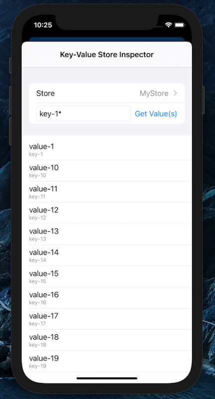
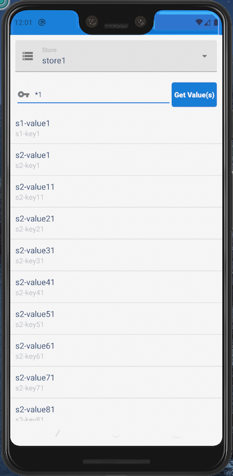

# Using Key-Value Stores for Secure Data Storage

Beginning in Mobile SDK 8.2, encrypted key-value stores offer an alternative to SmartStore for secure data storage on mobile devices. Key-value stores aren’t a replacement for SmartStore. They're designed for simpler storage scenarios that don't demand the full power of a relational database. An example is a response cache that requires your app to fetch data quickly from an opaque pool of values, unaware of data relationships or structure.

Key-value stores use AES-256 encryption and are stored on the device file system, each in its own directory. For each store, you provide a name that becomes the file name prefix. Store names can contain only letters, digits, and underscores, and can’t exceed 96 characters. An app can create as many stores as the device’s free space allows. Like SmartStore instances, key-value stores can be either user-based or global, depending on your use case.

Key-value stores are data-type agnostic and can contain different shapes and formats. For example, one value can be a JavaScript file, while the next is HTML, and the next a PNG image. A store doesn’t recognize or require relationships between its values.

To store binary data securely, the key-value store API provides special methods. Use these methods instead of legacy techniques such as creating a JSON envelope in SmartStore, or creating a file using the Mobile SDK file encryption APIs.

For larger data sets on Android, you can buffer data and stream the values into the key-value store. For example, you can build a REST response cache and then import it by passing `restResponse.asInputStream()` to the `saveStream()` method. The key-value store reads buffers in a loop from the data source and writes them to the store file. Similar streaming isn’t supported on Mobile SDK for iOS.

## Key-Value Store or SmartStore?

Consider using a key-value store when:

- A simple look-up by key serves your data set well.
- Your values aren’t stored as JSON or otherwise structured for atomic access.
- You're storing a large data set.
- You're storing binary data.
- You're developing a native app. In Mobile SDK 8.2, this feature isn’t available for hybrid or React Native apps.

SmartStore remains a better choice if:

- Your app demands more complex querying power—for example, query predicates that filter on multiple fields, or relational queries such as joins.
- Your app must be able to retrieve parts of the data. You can’t extract smaller parts of a value as you can with a SmartStore query such as `select {soup:some_indexfield} from {soup}`.
- Values are at least semi-structured. For example, your data set is JSON, but the shapes of individual values vary.
- You're developing a hybrid or React Native app.

## Key-Value Store Versions

Mobile SDK 8.2, 8.3, and 9.0 use version 1 of the key-value store. Mobile SDK 9.1 introduces version 2. These versions implement the same basic functionality, but version 2 adds a public accessor that returns a list of all keys in a given store. Invoking this accessor on version 1 stores returns `nil` on iOS and throws an exception on Android.

Mobile SDK 9.1 supports both store versions but creates only version 2 stores. Because Mobile SDK knows only a one-way hash of your keys but not the keys themselves, automatic migrations aren’t possible. To convert version 1 stores to version 2:

1.  Create a store in Mobile SDK 9.1.
2.  Use an iterative process to recreate your key-value pairs in the new store.

## Key-Value Store Classes

Key-value store factory methods let you create, list, and remove stores. On iOS, these methods are part of the `KeyValueEncryptedFileStore` class. On Android, import these methods from `SmartStoreSDKManager`:

- **Android only:** `import com.salesforce.androidsdk.smartstore.app.SmartStoreSDKManager`

Store management methods for iOS and Android are in their respective `KeyValueEncryptedFileStore` classes. Use these methods to save, access, and remove values, or to count or remove key-value pairs.

- **iOS (Swift):** `KeyValueEncryptedFileStore.swift` (included in `SalesforceSDKCore`)
- **Android:** `KeyValueEncryptedFileStore.java` (`com.salesforce.androidsdk.smartstore.store` package)

:::note

`KeyValueEncryptedFileStore` is a native Swift API. To access it in Objective-C, add the following line to your imports:

```swift
#import <SalesforceSDKCore/SalesforceSDKCore-Swift.h>
```

:::

## Set Up a Key-Value Store

1.  Construct an instance of `KeyValueEncryptedFileStore`.

    - iOS

      - : This constructor creates a store for the current user.

        ```swift
        let kv = KeyValueEncryptedFileStore.shared(withName: "<SOME NAME>")
        ```

    - Android

      - :
        ```java
        KeyValueEncryptedFileStore kv = SmartStoreSDKManager.getKeyValueStore("<SOME NAME>")
        ```

2.  Add static key-value pairs.

    - iOS (Swift)

      - :
        ```swift
        kv.saveValue(value, forKey: key)
        ```

    - Android (Java)

      - :
        ```java
        kv.saveValue(key, value)
        ```

    Or add values as input streams.

    - iOS (Swift)

      - : Not supported

    - Android (Java)

      - :
        ```java
        kv.saveStream(key, stream)
        ```

## Store and Retrieve Binary Data (Key-Value Store Version 2 or Later)

For managing binary data in a key-value store, Mobile SDK 10.0 introduces new iOS methods and reuses existing Android methods. Use these methods instead of the Mobile SDK file encryption APIs or a JSON envelope in SmartStore.

### iOS (Swift)

```swift
/// Saving binary data to a key value store
/// Updates the data stored for the given key or adds a new entry
/// if the key does not exist.
/// - Parameters:
/// - data: Data to add to the store.
/// - key: Key associated with the data.
/// - Returns: True on success, false on failure.
@objc @discardableResult
public func saveData(_ data: Data, forKey key: String) → Bool

/// Accesses the data associated with the given key.
@objc public func readData(key: String) → Data?
```

- Example

  - :

    ```swift
    // Saving binary data to key value store
    let sampleData = ...
    store.saveData(sampleData, forKey:"key")

    // Retrieving binary data back from key value store
    let savedData = store.readData(key: "key")
    ```

### Android (Java)

```java
/**
* Save value given as an input stream for the given key.
* Note: This method does not close the provided input stream
*
* @param key Unique identifier.
* @param stream Stream to be persisted.
* @return True - if successful, False - otherwise.
*/
public boolean saveStream(String key, InputStream stream) throws IOException;

* Retrieving binary data from a key value store.

/**
* Returns stream for value of given key.
*
* @param key Unique identifier.
* @return stream to value for given key or null if key not found.
*/
public InputStream getStream(String key);
```

- Example

  - :

    ```java
    // Saving binary data to key value store
    //

    byte[] arrayToWrite = ...;

    // In real life, you probably would start from a stream
    // (e.g. from a network call's response)
    InputStream streamToWrite =
        new ByteArrayInputStream(arrayToWrite);
    keyValueStore.saveStream("key", streamToWrite);

    //
    // Retrieving binary data back from key value store
    //

    InputStream streamToRead = keyValueStore.getStream("key");
    byte[] arrayRead = Encryptor.
        getByteArrayStreamFromStream(streamToRead).toByteArray();
    ```

## Get All Keys in a Store (Key-Value Store Version 2 or Later)

These methods return all keys in the given store.

- iOS (Swift)

  - :
    ```swift
    /// All keys in the store
    /// - Returns: all keys of stored values in a v2 store, nil if it's a v1 store
    @objc public func allKeys() -> [String]?
    ```

- Android (Java)

  - :
    ```java
    /**
      * Get all keys.
      * NB: will throw UnsupportedOperationException for a v1 store
      */
    public Set<String> keySet()
    ```

## Get the Key-Value Store Version

These APIs let you determine a store’s version at runtime.

- iOS (Swift)

  - :
    ```swift
    @objc public private(set) var storeVersion: Int
    ```

- Android (Java)

  - :
    ```java
    public int getStoreVersion()
    ```

## Inspect a Key-Value Store

To view a list of keys and values, select **Inspect Key-Value Store** in the Dev Support menu. This tool lets you search a store for all or part of a key name, returning all matching values.



## Example

Here’s an iOS Swift example:

```swift
...
writeToKv(value: "Joe", key: "Trader")
...

func writeToKv(value: String, key: String) {
    if let kv = KeyValueEncryptedFileStore.shared(
                    withName: "testShared") {
        if kv.saveValue(value, forKey: key) {
            let numEntries = kv.count()
            SalesforceLogger.d(RootViewController.self,
                message:"\nValue added: \(value), " +
                    "Number of entries: \(numEntries)")
        }
    }
}
```

**See Also**

- [In-App Developer Support](tools-dev-support.md)
