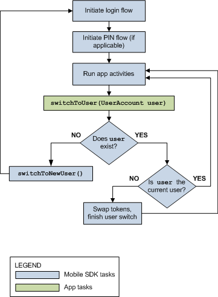

# Android Native APIs

Native classes in Mobile SDK for Android do most of the work for multi-user support. Your app makes a few simple calls and handles any data cached in memory. You also have the option of customizing the user switching activity.

To support user switching, Mobile SDK for Android defines native classes in the `com.salesforce.androidsdk.accounts`, `com.salesforce.androidsdk.ui`, and `com.salesforce.androidsdk.util` packages. Classes in the `com.salesforce.androidsdk.accounts` package include:

- `UserAccount`
- `UserAccountManager`

The `com.salesforce.androidsdk.ui` package contains the `AccountSwitcherActivity` class. You can extend this class to add advanced customizations to the account switcher activity.

The `com.salesforce.androidsdk.util` package contains the `UserSwitchReceiver` abstract class. You must implement this class if your app caches data other than tokens.

The following sections briefly describe these classes. For full API reference documentation, see [https://forcedotcom.github.io/SalesforceMobileSDK-Android/index.html](https://forcedotcom.github.io/SalesforceMobileSDK-Android/index.html).

## Multi-User Flow

For native Android apps, the `UserAccountManager.switchToUser()` Mobile SDK method launches the multi-user flow. Once your app calls this method, the Mobile SDK core handles the execution flow through all possible paths. The following diagram illustrates this flow.

