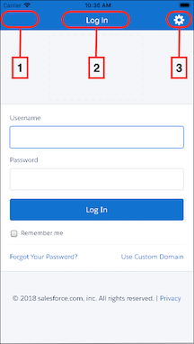

# Customizing the iOS Login Screen Programmatically

Mobile SDK for iOS provides extensive options for customizing the style and behavior of the login screen's navigation bar. You can make simple declarative changes to control widget appearance and visibility, or you can reimagine the navigation bar by extending the login view controller class.

Here's the standard Salesforce login screen.



Navigation bar widgets you can customize include the back button (1), which is normally hidden, the title (2), and the Settings icon (3). You can also hide the entire navigation bar. By default, the login screen shows both the top navigation bar and its embedded Settings icon.

The Settings icon  is often referred to as the “gear” icon due to its sprocket-like shape. Customers can use the Settings icon to select a login server from a built-in list, or to specify a custom login URI. Some companies, however, don’t allow users to choose the login server. To disable login server selection, you can hide either the Settings icon itself or the entire navigation bar. You can also customize the navigation bar's color and the color and font of its text. Use the following `SFSDKLoginViewControllerConfig` properties to control the visibility and appearance of these UI elements.

## showSettingsIcon

Controls the display of the Settings icon only. Does not affect the visibility of the navigation bar.

- Behavior

  - :
    |Value|Meaning|
    |-----|-------|
    |`YES` (default)|Default value. The Settings icon is visible and accessible.|
    |`NO`|The Settings icon is hidden. Users cannot access the login host list and cannot add custom hosts.|

## showNavbar

Controls the display of the navigation bar, which in turn hides the Settings icon.

- Behavior

  - :
    |Value|Meaning|
    |-----|-------|
    |`YES` (default)|Default value. The navigation bar is visible. The Settings icon display depends on the `showSettingsIcon` property.|
    |`NO`|The navigation bar and the Settings icon are hidden. Users cannot access the login host list and cannot add custom hosts.|

:::note

To hide the gear icon in hybrid apps, apply these steps in the native wrapper app.

:::

## Navigation Bar Colors and Font

You can set the following style properties:

- **`navBarColor`**
- **`navBarTextColor`**
- **`navBarFont`**

The following example shows how to set the Settings icon visibility and navigation bar style. You import the header file and add the subsequent lines to the `application:didFinishLaunchingWithOptions:` method of your `AppDelegate` class.

```swift

let loginViewConfig = SalesforceLoginViewControllerConfig()
loginViewConfig.showsSettingsIcon = false
loginViewConfig.showsNavigationBar = true
loginViewConfig.navigationBarColor = UIColor(red: 0.051, green: 0.765, blue: 0.733, alpha: 1.0)
loginViewConfig.navigationBarTextColor = UIColor.white
loginViewConfig.navigationBarFont = UIFont(name: "Helvetica", size: 16.0)
UserAccountManager.shared.loginViewControllerConfig = loginViewConfig
```

## Overriding Navigation Bar Widgets by Extending SFLoginViewController

To provide in-depth customization of the navigation bar, extend the `SFLoginViewController` class and implement the required methods. Doing so gives you the power to

- **Enable the back button**—Some developers enable the back button to enhance the customer experience if login fails. You're responsible for providing a custom action if you enable the back button. If you don't customize the action, Mobile SDK uses its default behavior for failed logins, which ignores the back button.
- **Override the default title widget**—You can provide your own title text and define custom actions.
- **Override the default Settings icon**—You can substitute a custom icon for the gear image.

Here's a partially coded example.

1.  Extend `SFLoginViewController`.

    ```swift

    @interface SFLoginExtendedViewController : SFLoginViewController

    @end

    @implementation SFLoginExtendedViewController

    - (UIBarButtonItem *)createBackButton {
        // Setup left bar button:
        // UIImage *image = [[SFSDKResourceUtils
        //                imageNamed:@"globalheader-back-arrow"]
        //    imageWithRenderingMode:UIImageRenderingModeAlwaysTemplate];
        //
        // Return a custom UIBarButtonItem:
        // return [[UIBarButtonItem alloc]
        //    initWithImage:image
        //            style:UIBarButtonItemStylePlain
        //           target:self action:nil];
    }

    - (void)handleBackButtonAction {
        [super handleBackButtonAction];
        // Add your custom code here
    }

    - (BOOL)shouldShowBackButton {
        // Add your custom code here.
        // Return YES to show the back button
    }

    - (UIBarButtonItem *)createSettingsButton {
        // Set up left bar button:
        // UIImage *image = [[SFSDKResourceUtils
        //                 imageNamed:@"login-window-gear"]
        //     imageWithRenderingMode:UIImageRenderingModeAlwaysTemplate];
        //
        // Return a custom UIBarButtonItem:
        // return [[UIBarButtonItem alloc]
        //     initWithImage:image
        //             style:UIBarButtonItemStylePlain
        //            target:self action:nil];
    }

    - (UIView *)createTitleItem {
        // Setup top item.
        // Create a UIView for title
        // UIView *item = [[UIView alloc] ... ];
        NSString *title = [SFSDKResourceUtils localizedString:@"MobileSyncLogin"];
        ...
        return item;
    }

    - (void)viewDidLoad {
        [super viewDidLoad];
        // Do any additional setup after loading the view.
    }

    @end

    ```

2.  In the `application:didFinishLoadingWithOptions:` method of your `AppDelegate` class, set up the following block.

    ```swift

    ...
        [SFUserAccountManager sharedInstance].
            loginViewControllerConfig.loginViewControllerCreationBlock =
                ^SFLoginViewController * _Nonnull{
                    SFLoginExtendedViewController *controller =
                        [[SFLoginExtendedViewController alloc] init];
                    return controller;
            };
        [SFUserAccountManager sharedInstance].loginViewControllerConfig =
            loginViewConfig;
        ....
    ```

**See Also**

- [Setting Custom Login Servers in iOS Apps](oauth-custom-login-host-ios.md)
