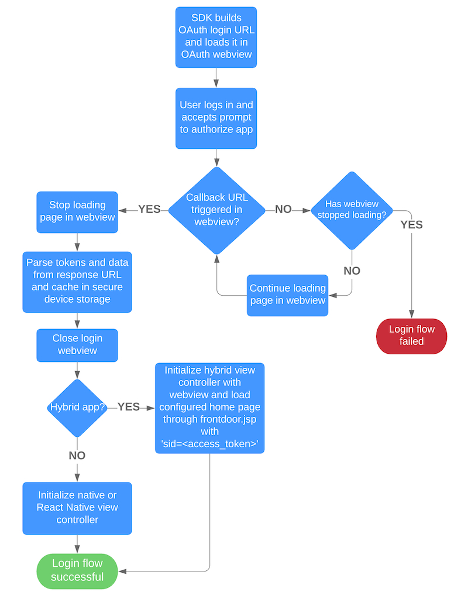

# Mobile SDK Login and Authentication Flow—Detailed Look

Mobile SDK handles the complex login and authentication flow internally so that you don’t have to orchestrate it yourself. If your app is reporting login failures, use this detailed description to help pinpoint the problem.

