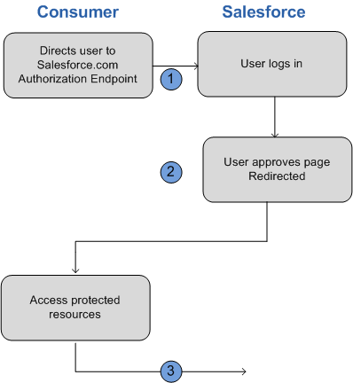

# OAuth 2.0 User-Agent Flow

With the OAuth 2.0 user-agent flow, users authorize a desktop or mobile app to access data by using an external or embedded browser. Client apps running in a browser using a scripting language such as JavaScript can also use this flow. This flow uses the [OAuth 2.0 implicit grant type](https://tools.ietf.org/html/rfc6749#section-4.2).

In the user-agent flow, the connected app, which integrates the client app with the Salesforce API, receives the access token as an HTTP redirection. The connected app requests that the authorization server redirects the user-agent to a web server or to an accessible local resource. The web server can extract the access token from the response and pass it to the connected app. For security, the token response is provided as a hash tag (#) fragment on the URL. This format prevents the token from being passed to the server or to any other servers in referral headers.

:::warning

Because the access token is encoded into the redirection URL, it can be exposed to the user and other apps on the device.

If you’re using JavaScript to authenticate, call `window.location.replace();` to remove the callback from the browser’s history.

:::

:::note

Connected apps for these types of clients can protect per-user secrets. But the client secret is accessible and exploitable because client executables reside on the user’s device. For this reason, the user-agent flow doesn’t use the client secret. Authorization is based on the user-agent’s same-origin policy. Also, the user-agent flow doesn’t support out-of-band posts.

:::



For example, you use Salesforce Mobile SDK to build a mobile app that looks up customer contact information from your Salesforce org. Mobile SDK implements the OAuth 2.0 user-agent flow for your connected app, integrating the mobile app with your Salesforce API and giving it authorized access to the defined data. The flow follows these steps.

::include{src="../../shared/example_steps.md"}

## User-Agent Flow in Mobile SDK 11.0 and On

:::note

Up until Mobile SDK 10.2, OAuth 2.0 User-Agent Flow is used for web view authentication on both iOS and Android and for advanced authentication on Android. Starting in Mobile SDK 11.0, the default authentication on both platforms uses the [OAuth 2.0 Web Server Flow](oauth-web-server-flow.md) with Proof Key for Code Exchange (PKCE) for increased security.

:::

If you want to continue using User-Agent Flow for your app in Mobile SDK 11.0 and on, the option can be enabled in the `SalesforceSDKManager`. Before initiating a login, call one of the following methods in your application class’s `init` method.

- Android

  - :

    ```java
    SalesforceSDKManager.getInstance().setUseWebServerAuthentication(false)
    ```

- iOS

  - : Swift

    ```swift
    SalesforceManager.shared.useWebServerAuthentication = false
    ```

    Objective-C

    ```objc
    [SalesforceSDKManager sharedManager].useWebServerAuthentication = NO;
    ```
